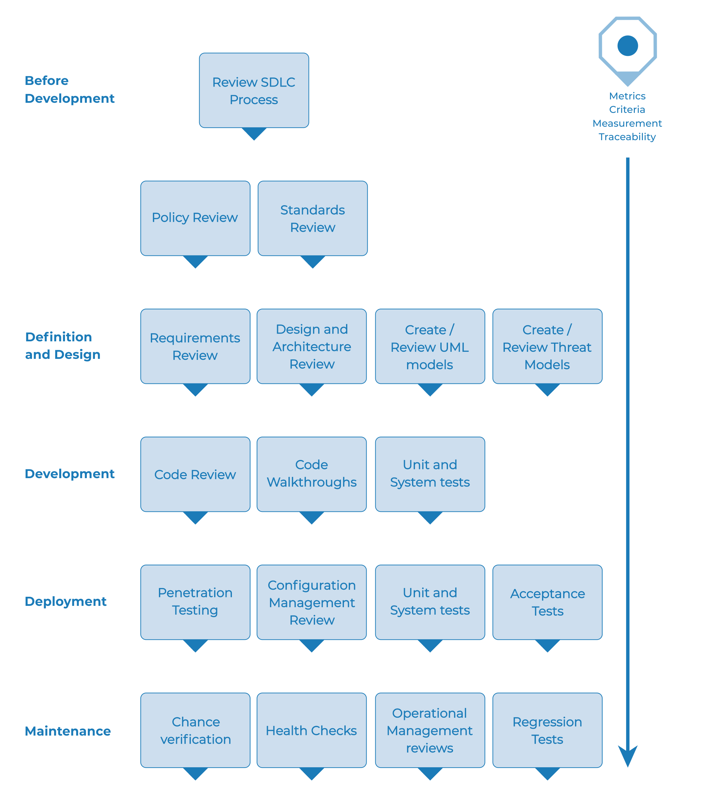

# The Web Security Testing Framework

## Overview

This section describes a typical testing framework that can be developed within an organization. It can be seen as a reference framework comprised of techniques and tasks that are appropriate at various phases of the software development life cycle (SDLC). Companies and project teams can use this model to develop their own testing framework, and to scope testing services from vendors. This framework should not be seen as prescriptive, but as a flexible approach that can be extended and molded to fit an organization's development process and culture.

This section aims to help organizations build a complete strategic testing process, and is not aimed at consultants or contractors who tend to be engaged in more tactical, specific areas of testing.

It is critical to understand why building an end-to-end testing framework is crucial to assessing and improving software security. In *Writing Secure Code*, Howard and LeBlanc note that issuing a security bulletin costs Microsoft at least $100,000, and it costs their customers collectively far more than that to implement the security patches. They also note that the US government's [CyberCrime web site](https://www.justice.gov/criminal-ccips) details recent criminal cases and the loss to organizations. Typical losses far exceed USD $100,000.

With economics like this, it is little wonder why software vendors move from solely performing black-box security testing, which can only be performed on applications that have already been developed, to concentrating on testing in the early cycles of application development, such as during definition, design, and development.

Many security practitioners still see security testing in the realm of penetration testing. As discussed in the previous chapter, while penetration testing has a role to play, it is generally inefficient at finding bugs and relies excessively on the skill of the tester. It should only be considered as an implementation technique, or to raise awareness of production issues. To improve the security of applications, the security quality of the software must be improved. That means testing security during the definition, design, development, deployment, and maintenance stages, and not relying on the costly strategy of waiting until code is completely built.

As discussed in the introduction of this document, there are many development methodologies, such as the Rational Unified Process, eXtreme and Agile development, and traditional waterfall methodologies. The intent of this guide is to suggest neither a particular development methodology, nor provide specific guidance that adheres to any particular methodology. Instead, we are presenting a generic development model, and the reader should follow it according to their company process.

This testing framework consists of activities that should take place:

- Before development begins,
- During definition and design,
- During development,
- During deployment, and
- During maintenance and operations.

## Phase 1 Before Development Begins

### Phase 1.1 Define a SDLC

Before application development starts, an adequate SDLC must be defined where security is inherent at each stage.

### Phase 1.2 Review Policies and Standards

Ensure that there are appropriate policies, standards, and documentation in place. Documentation is extremely important as it gives development teams guidelines and policies that they can follow. People can only do the right thing if they know what the right thing is.

If the application is to be developed in Java, it is essential that there is a Java secure coding standard. If the application is to use cryptography, it is essential that there is a cryptography standard. No policies or standards can cover every situation that the development team will face. By documenting the common and predictable issues, there will be fewer decisions that need to be made during the development process.

### Phase 1.3 Develop Measurement and Metrics Criteria and Ensure Traceability

Before development begins, plan the measurement program. By defining criteria that need to be measured, it provides visibility into defects in both the process and product. It is essential to define the metrics before development begins, as there may be a need to modify the process in order to capture the data.

## Phase 2 During Definition and Design

### Phase 2.1 Review Security Requirements

Security requirements define how an application works from a security perspective. It is essential that the security requirements are tested. Testing in this case means testing the assumptions that are made in the requirements and testing to see if there are gaps in the requirements definitions.

For example, if there is a security requirement that states that users must be registered before they can get access to the whitepapers section of a website, does this mean that the user must be registered with the system or should the user be authenticated? Ensure that requirements are as unambiguous as possible.

When looking for requirements gaps, consider looking at security mechanisms such as:

- User management
- Authentication
- Authorization
- Data confidentiality
- Integrity
- Accountability
- Session management
- Transport security
- Tiered system segregation
- Legislative and standards compliance (including privacy, government, and industry standards)

### Phase 2.2 Review Design and Architecture

Applications should have a documented design and architecture. This documentation can include models, textual documents, and other similar artifacts. It is essential to test these artifacts to ensure that the design and architecture enforce the appropriate level of security as defined in the requirements.

Identifying security flaws in the design phase is not only one of the most cost-efficient places to identify flaws, but can be one of the most effective places to make changes. For example, if it is identified that the design calls for authorization decisions to be made in multiple places, it may be appropriate to consider a central authorization component. If the application is performing data validation at multiple places, it may be appropriate to develop a central validation framework (i.e. fixing input validation in one place, rather than in hundreds of places, is far cheaper).

If weaknesses are discovered, they should be given to the system architect for alternative approaches.

### Phase 2.3 Create and Review UML Models

Once the design and architecture is complete, build Unified Modeling Language (UML) models that describe how the application works. In some cases, these may already be available. Use these models to confirm with the systems designers an exact understanding of how the application works. If weaknesses are discovered, they should be given to the system architect for alternative approaches.

### Phase 2.4 Create and Review Threat Models

Armed with design and architecture reviews and the UML models explaining exactly how the system works, undertake a threat modeling exercise. Develop realistic threat scenarios. Analyze the design and architecture to ensure that these threats have been mitigated, accepted by the business, or assigned to a third party, such as an insurance firm. When identified threats have no mitigation strategies, revisit the design and architecture with the systems architect to modify the design.

## Phase 3 During Development

Theoretically, development is the implementation of a design. However, in the real world, many design decisions are made during code development. These are often smaller decisions that were either too detailed to be described in the design, or issues where no policy or standard guidance was offered. If the design and architecture were not adequate, the developer will be faced with many decisions. If there were insufficient policies and standards, the developer will be faced with even more decisions.

### Phase 3.1 Code Walkthrough

The security team should perform a code walkthrough with the developers, and in some cases, the system architects. A code walkthrough is a high-level look at the code during which the developers can explain the logic and flow of the implemented code. It allows the code review team to obtain a general understanding of the code, and allows the developers to explain why certain things were developed the way they were.

The purpose is not to perform a code review, but to understand at a high level the flow, the layout, and the structure of the code that makes up the application.

### Phase 3.2 Code Reviews

Armed with a good understanding of how the code is structured and why certain things were coded the way they were, the tester can now examine the actual code for security defects.

Static code reviews validate the code against a set of checklists, including:

- Business requirements for availability, confidentiality, and integrity;
- OWASP Guide or Top 10 Checklists for technical exposures (depending on the depth of the review);
- Specific issues relating to the language or framework in use, such as the Scarlet paper for PHP or [Microsoft Secure Coding checklists for ASP.NET](https://msdn.microsoft.com/en-us/library/ff648269.aspx); and
- Any industry-specific requirements, such as Sarbanes-Oxley 404, COPPA, ISO/IEC 27002, APRA, HIPAA, Visa Merchant guidelines, or other regulatory regimes.

In terms of return on resources invested (mostly time), static code reviews produce far higher quality returns than any other security review method and rely least on the skill of the reviewer. However, they are not a silver bullet and need to be considered carefully within a full-spectrum testing regime.

For more details on OWASP checklists, please refer to the latest edition of the [OWASP Top 10](https://owasp.org/www-project-top-ten/).

## Phase 4 During Deployment

### Phase 4.1 Application Penetration Testing

Having tested the requirements, analyzed the design, and performed code review, it might be assumed that all issues have been caught. Hopefully this is the case, but penetration testing the application after it has been deployed provides an additional check to ensure that nothing has been missed.

### Phase 4.2 Configuration Management Testing

The application penetration test should include an examination of how the infrastructure was deployed and secured. It is important to review configuration aspects, no matter how small, to ensure that none are left at a default setting that may be vulnerable to exploitation.

## Phase 5 During Maintenance and Operations

### Phase 5.1 Conduct Operational Management Reviews

There needs to be a process in place which details how the operational side of both the application and infrastructure is managed.

### Phase 5.2 Conduct Periodic Health Checks

Monthly or quarterly health checks should be performed on both the application and infrastructure to ensure no new security risks have been introduced and that the level of security is still intact.

### Phase 5.3 Ensure Change Verification

After every change has been approved and tested in the QA environment and deployed into the production environment, it is vital that the change is checked to ensure that the level of security has not been affected by the change. This should be integrated into the change management process.

## A Typical SDLC Testing Workflow

The following figure shows a typical SDLC Testing Workflow.

\
 *Figure 3-1: Typical SDLC testing workflow*
