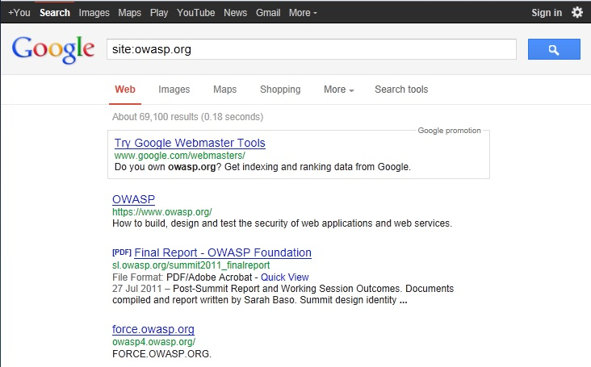

## Summary

There are direct and indirect elements to search engine discovery and reconnaissance. Direct methods relate to searching the indexes and the associated content from caches. Indirect methods relate to gleaning sensitive design and configuration information by searching forums, newsgroups, and tendering websites.

Once a search engine robot has completed crawling, it commences indexing the web page based on tags and associated attributes, such as `<TITLE>`, in order to return the relevant search results[1](#fn1). If the robots.txt file is not updated during the lifetime of the web site, and inline HTML meta tags that instruct robots not to index content have not been used, then it is possible for indexes to contain web content not intended to be included in by the owners. Website owners may use the previously mentioned robots.txt, HTML meta tags, authentication, and tools provided by search engines to remove such content.

## Test Objectives

To understand what sensitive design and configuration information of the application/system/organization is exposed both directly (on the organization's website) or indirectly (on a third party website).

## How to Test

Use a search engine to search for:

- Network diagrams and configurations
- Archived posts and emails by administrators and other key staff
- Log on procedures and username formats
- Usernames and passwords
- Error message content
- Development, test, UAT and staging versions of the website

### Search Operators

Using the advanced “site:” search operator, it is possible to restrict search results to a specific domain[2](#fn2). Do not limit testing to just one search engine provider as they may generate different results depending on when they crawled content and their own algorithms. Consider using the following search engines:

- Baidu
- binsearch.info
- Bing
- Duck Duck Go
- ixquick/Startpage
- Google
- Shodan
- PunkSpider

Duck Duck Go and ixquick/Startpage provide reduced information leakage about the tester.

Google provides the Advanced “cache:” search operator[2](#fn2), but this is the equivalent to clicking the “Cached” next to each Google Search Result. Hence, the use of the Advanced “site:” Search Operator and then clicking “Cached” is preferred.

The Google SOAP Search API supports the doGetCachedPage and the associated doGetCachedPageResponse SOAP Messages[3](#fn3) to assist with retrieving cached pages. An implementation of this is under development by the [OWASP “Google Hacking” Project](https://www.owasp.org/index.php/Category:OWASP_Google_Hacking_Project).

PunkSpider is web application vulnerability search engine. It is of little use for a penetration tester doing manual work. However it can be useful as demonstration of easiness of finding vulnerabilities by script-kiddies.

**Example** To find the web content of owasp.org indexed by a typical search engine, the syntax required is:

`site:owasp.org`

To display the index.html of owasp.org as cached, the syntax is:

`cache:owasp.org`

### Google Hacking Database

The Google Hacking Database is list of useful search queries for Google. Queries are put in several categories:

- Footholds
- Files containing usernames
- Sensitive Directories
- Web Server Detection
- Vulnerable Files
- Vulnerable Servers
- Error Messages
- Files containing juicy info
- Files containing passwords
- Sensitive Online Shopping Info

## References

### Web

1. Google Basics Learn How Google Discovers, Crawls, and Serves Web Pages - https://support.google.com/webmasters/answer/70897?hl=en
 

2. Operators and More Search Help - https://support.google.com/websearch/answer/136861?hl=en
 

3. Google Hacking Database - http://www.exploit-db.com/google-dorks/
 

## Tools

4. FoundStone SiteDigger - http://www.mcafee.com/uk/downloads/free-tools/sitedigger.aspx
 

5. Google Hacker - http://yehg.net/lab/pr0js/files.php/googlehacker.zip
 

6. Bishop Fox&apos;s Google Hacking Diggity Project - http://www.bishopfox.com/resources/tools/google-hacking-diggity/
 

7. PunkSPIDER - http://punkspider.hyperiongray.com/
 

## Remediation

Carefully consider the sensitivity of design and configuration information before it is posted online.

Periodically review the sensitivity of existing design and configuration information that is posted online.
