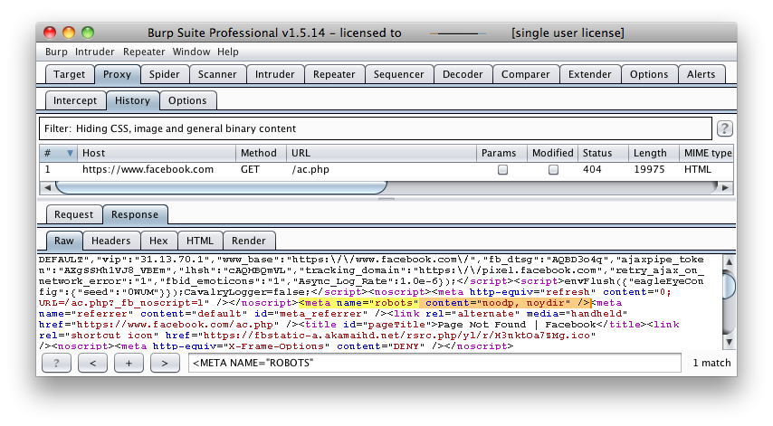

# Review Webserver Metafiles for Information Leakage

|ID          |
|------------|
|WSTG-INFO-03|

## Summary

This section describes how to test the robots.txt file for information leakage of the web application's directory or folder path(s). Furthermore, the list of directories that are to be avoided by Spiders, Robots, or Crawlers can also be created as a dependency for [Map execution paths through application](07-Map_Execution_Paths_Through_Application.md)

## Test Objectives

1. Information leakage of the web application's directory or folder path(s).
2. Create the list of directories that are to be avoided by Spiders, Robots, or Crawlers.

## How to Test

Note: Any of the actions performed below with `wget` could also be done with `curl`. Many Dynamic Application Security Testing (DAST) tools such as ZAP and Burp Suite include checks or parsing for these resources as part of their spider/crawler functionality. They can also be identified using various 'Google Dorks' or leveraging advanced search features such as `inurl:`.

### robots.txt

Web Spiders, Robots, or Crawlers retrieve a web page and then recursively traverse hyperlinks to retrieve further web content. Their accepted behavior is specified by the [Robots Exclusion Protocol](https://www.robotstxt.org) of the [robots.txt](https://www.robotstxt.org/) file in the web root directory.

As an example, the beginning of the robots.txt file from [https://www.google.com/robots.txt](https://www.google.com/robots.txt) sampled on 2020 May 5 is quoted below:

```text
User-agent: *
Disallow: /search
Allow: /search/about
Allow: /search/static
Allow: /search/howsearchworks
Disallow: /sdch
...
```

The *User-Agent* directive refers to the specific web spider/robot/crawler. For example the *User-Agent: Googlebot* refers to the spider from Google while “User-Agent: bingbot” refers to crawler from Microsoft/Yahoo!. `User-Agent: *` in the example above applies to all [web spiders/robots/crawlers](https://support.google.com/webmasters/answer/6062608?visit_id=637173940975499736-3548411022&rd=1) as quoted below:

`User-agent: *`

The `Disallow` directive specifies which resources are prohibited by spiders/robots/crawlers. In the example above, the following are prohibited:

```text
...
Disallow: /search
...
Disallow: /sdch
...
```

Web spiders/robots/crawlers can [intentionally ignore](https://blog.isc2.org/isc2_blog/2008/07/the-attack-of-t.html) the `Disallow` directives specified in a robots.txt file, such as those from [Social Networks](https://www.htbridge.com/news/social_networks_can_robots_violate_user_privacy.html) to ensure that shared linked are still valid. Hence, robots.txt should not be considered as a mechanism to enforce restrictions on how web content is accessed, stored, or republished by third parties.

#### robots.txt in Webroot - with wget or curl

The robots.txt file is retrieved from the web root directory of the web server. For example, to retrieve the robots.txt from `www.google.com` using `wget` or `curl`:

```bash
$ wget https://www.google.com/robots.txt
--2020-05-05 08:33:43--  https://www.google.com/robots.txt
Resolving www.google.com (www.google.com)... 172.217.13.164, 2607:f8b0:4020:805::2004
Connecting to www.google.com (www.google.com)|172.217.13.164|:443... connected.
HTTP request sent, awaiting response... 200 OK
Length: unspecified [text/plain]
Saving to: ‘robots.txt’

robots.txt                                 [ <=>                                                                        ]   6.84K  --.-KB/s    in 0.001s  

2020-05-05 08:33:43 (9.89 MB/s) - ‘robots.txt’ saved [7004]

$ head -n5 robots.txt 
User-agent: *
Disallow: /search
Allow: /search/about
Allow: /search/static
Allow: /search/howsearchworks
$

$ curl -O http://www.google.com/robots.txt
  % Total    % Received % Xferd  Average Speed   Time    Time     Time  Current
                                 Dload  Upload   Total   Spent    Left  Speed
100  7004    0  7004    0     0   151k      0 --:--:-- --:--:-- --:--:--  151k

$ head -n5 robots.txt 
User-agent: *
Disallow: /search
Allow: /search/about
Allow: /search/static
Allow: /search/howsearchworks
$
```

#### Analyze robots.txt Using Google Webmaster Tools

Web site owners can use the Google “Analyze robots.txt” function to analyse the website as part of its [Google Webmaster Tools](https://www.google.com/webmasters/tools). This tool can assist with testing and the procedure is as follows:

1. Sign into Google Webmaster Tools with a Google account.
2. On the dashboard, enter the URL for the site to be analyzed.
3. Choose between the available methods and follow the on screen instruction.

### META Tag

`<META>` tags are located within the HEAD section of each HTML Document and should be consistent across a web site in the likely event that the robot/spider/crawler start point does not begin from a document link other than webroot i.e. a [deep link](https://en.wikipedia.org/wiki/Deep_linking).

If there is no `<META NAME="ROBOTS" ... >` entry then the “Robots Exclusion Protocol” defaults to `INDEX,FOLLOW` respectively. Therefore, the other two valid entries defined by the “Robots Exclusion Protocol” are prefixed with `NO...` i.e. `NOINDEX` and `NOFOLLOW`.

Web spiders/robots/crawlers can intentionally ignore the `<META NAME="ROBOTS"` tag as the robots.txt file convention is preferred.  Hence, **<META> Tags should not be considered the primary mechanism, rather a complementary control to robots.txt**.

#### META Tags - with Burp

Based on the Disallow directive(s) listed within the robots.txt file in webroot, a regular expression search for `<META NAME="ROBOTS"` within each web page is undertaken and the result compared to the robots.txt file in webroot.

For example, the robots.txt file from facebook.com has a `Disallow: /ac.php` entry [http://facebook.com/robots.txt](http://facebook.com/robots.txt) and the resulting search for `<META NAME="ROBOTS"` shown below:

\
*Figure 4.1.3-1: Facebook Meta Tag Example*

The above might be considered a fail since `INDEX,FOLLOW` is the default `<META>` Tag specified by the “Robots Exclusion Protocol” yet `Disallow: /ac.php` is listed in robots.txt.

### sitemap.xml

A sitemap is a file where a developer or organization can provide information about the pages, videos, and other files offered by the site or application, and the relationship between them. Search engines can use this file to more intelligently explore your site. Testers can use `sitemap.xml` files to learn more about the site or application to explore it more completely.

#### sitemap.xml - with wget

The following excerpt is from Google's primary sitemap retrieved 2020 May 05.

```bash
$ wget https://www.google.com/sitemap.xml && head -n8 sitemap.xml
--2020-05-05 12:23:30--  https://www.google.com/sitemap.xml
Resolving www.google.com (www.google.com)... 172.217.13.164, 2607:f8b0:4020:806::2004
Connecting to www.google.com (www.google.com)|172.217.13.164|:443... connected.
HTTP request sent, awaiting response... 200 OK
Length: 2049 (2.0K) [text/xml]
Saving to: ‘sitemap.xml.3’

sitemap.xml.3                          100%[===========================================================================>]   2.00K  --.-KB/s    in 0s      

2020-05-05 12:23:30 (9.24 MB/s) - ‘sitemap.xml.3’ saved [2049/2049]

<?xml version="1.0" encoding="UTF-8"?>
<sitemapindex xmlns="http://www.google.com/schemas/sitemap/0.84">
  <sitemap>
    <loc>https://www.google.com/gmail/sitemap.xml</loc>
  </sitemap>
  <sitemap>
    <loc>https://www.google.com/forms/sitemaps.xml</loc>
  </sitemap>
...
```

Exploring from there a tester may wish to retrieve the gmail sitemap `https://www.google.com/gmail/sitemap.xml`: 

```bash
$ wget https://www.google.com/gmail/sitemap.xml && head -n8 sitemap.xml
--2020-05-05 12:26:52--  https://www.google.com/gmail/sitemap.xml
Resolving www.google.com (www.google.com)... 172.217.13.164, 2607:f8b0:4020:806::2004
Connecting to www.google.com (www.google.com)|172.217.13.164|:443... connected.
HTTP request sent, awaiting response... 200 OK
Length: 971960 (949K) [text/xml]
Saving to: ‘sitemap.xml’

sitemap.xml                            100%[===========================================================================>] 949.18K  --.-KB/s    in 0.1s    

2020-05-05 12:26:52 (8.29 MB/s) - ‘sitemap.xml’ saved [971960/971960]

<?xml version="1.0" encoding="UTF-8"?>
<urlset xmlns="http://www.sitemaps.org/schemas/sitemap/0.9" xmlns:xhtml="http://www.w3.org/1999/xhtml">
  <url>
    <loc>https://www.google.com/intl/am/gmail/about/</loc>
    <xhtml:link href="https://www.google.com/gmail/about/" hreflang="x-default" rel="alternate"/>
    <xhtml:link href="https://www.google.com/intl/el/gmail/about/" hreflang="el" rel="alternate"/>
    <xhtml:link href="https://www.google.com/intl/it/gmail/about/" hreflang="it" rel="alternate"/>
    <xhtml:link href="https://www.google.com/intl/ar/gmail/about/" hreflang="ar" rel="alternate"/>
...
```

### security.txt

`security.txt` is a [proposed standard](https://securitytxt.org/) which allows websites to define security policies and contact details. There are multiple reasons this might be of interest in testing scenarios, including but not limited to:

- Identifying further paths or resources to include in discovery/analysis.
- Open Source intelligence gathering.
- Finding information on Bug Bounties, etc.
- Social Engineering.

The file may be present either in the root of the webserver or in the `.well-known/` directory. Ex:

- https://example.com/security.txt
- https://example.com/.well-known/security.txt

#### security.txt with wget

Here is a real world example retrieved from LinkedIn 2020 May 05:

```bash
$ wget https://www.linkedin.com/.well-known/security.txt && cat security.txt
--2020-05-05 15:30:31--  https://www.linkedin.com/.well-known/security.txt
Resolving www.linkedin.com (www.linkedin.com)... 108.174.10.10, 2620:109:c002::6cae:a0a
Connecting to www.linkedin.com (www.linkedin.com)|108.174.10.10|:443... connected.
HTTP request sent, awaiting response... 200 OK
Length: 333 [text/plain]
Saving to: ‘security.txt’

security.txt                           100%[===========================================================================>]     333  --.-KB/s    in 0s      

2020-05-05 15:30:31 (2.71 MB/s) - ‘security.txt’ saved [333/333]

# Conforms to IETF `draft-foudil-securitytxt-07`
Contact: mailto:security@linkedin.com
Contact: https://www.linkedin.com/help/linkedin/answer/62924
Encryption: https://www.linkedin.com/help/linkedin/answer/79676
Canonical: https://www.linkedin.com/.well-known/security.txt
Policy: https://www.linkedin.com/help/linkedin/answer/62924
```

### humans.txt

`humans.txt` is an initiative for knowing the people behind a website. It takes the form of a text file that contains information about the different people who have contributed to building the website. See [humanstxt](http://humanstxt.org/) for more info. This file often (though not always) contains information for carreer or job sites/paths.

#### humans.txt with wget

The following example was retrieved from Google 2020 May 05:

```bash
kali@kali:~/wstgtmp$ wget https://www.google.com/humans.txt && cat humans.txt
--2020-05-05 12:47:41--  https://www.google.com/humans.txt
Resolving www.google.com (www.google.com)... 172.217.13.164, 2607:f8b0:4020:804::2004
Connecting to www.google.com (www.google.com)|172.217.13.164|:443... connected.
HTTP request sent, awaiting response... 200 OK
Length: 286 [text/plain]
Saving to: ‘humans.txt’

humans.txt                             100%[===========================================================================>]     286  --.-KB/s    in 0s      

2020-05-05 12:47:41 (77.1 MB/s) - ‘humans.txt’ saved [286/286]

Google is built by a large team of engineers, designers, researchers, robots, and others in many different sites across the globe. It is updated continuously, and built with more tools and technologies than we can shake a stick at. If you'd like to help us out, see careers.google.com.
```

### Other .well-known Information Sources

There are other RFCs and Internet drafts which suggest standardized uses of files within the `.well-known/` directory. Lists of which can be found [here](https://en.wikipedia.org/wiki/List_of_/.well-known/_services_offered_by_webservers) or [here](https://www.iana.org/assignments/well-known-uris/well-known-uris.xhtml).

If would be fairly simple for a tester to review the RFC/drafts are create a list to be supplied to a crawler or fuzzer, in order to verify the existence or content of such files.

## Tools

- Browser (View Source or Dev Tools functionality)
- curl
- wget
- Burp Suite
- ZAP
