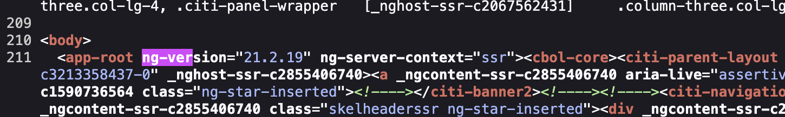
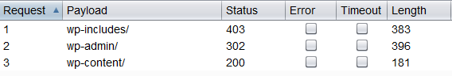
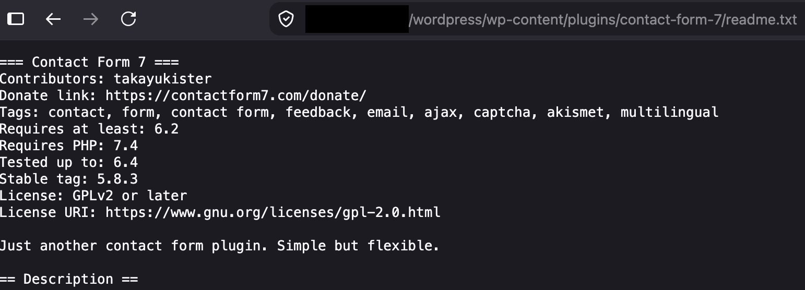
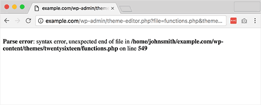
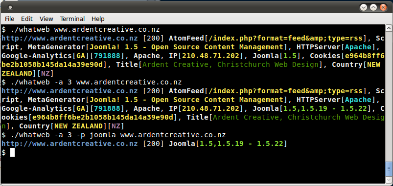

# Fingerprint Web Application Framework

|ID          |
|------------|
|WSTG-INFO-08|

## Summary

It wouldn't be a stretch to say that almost every conceivable idea for a web application has already been put into development. With the vast number of free and open-source software projects that are actively developed and deployed globally, it is very likely that an application security test will encounter a target that is entirely or partly dependent on these well-known applications or frameworks (e.g. WordPress, phpBB, Mediawiki, etc). Knowing the web application components that are being tested helps the testing process significantly and will also drastically reduce the effort required during the test. These well-known web applications have specific HTML headers, cookies, and directory structures that can be enumerated to identify the application. Most web frameworks have several markers in these locations, which can assist an attacker or tester in recognizing them. This is basically what all automatic tools do, they look for a marker from a predefined location and then compare it to the database of known signatures. For better accuracy, several markers are usually used.

## Test Objectives

- Fingerprint the components used by the web applications.

## How to Test

### Black-Box Testing

There are several common locations to consider in order to identify frameworks or components:

- HTTP headers
- Cookies
- HTML source code
- Specific files and folders
- File extensions
- Error messages

#### HTTP Headers

The most basic form of identifying a web framework is to look at the `X-Powered-By` field in the HTTP response header. Many tools can be used to fingerprint a target, the simplest one is netcat.

Consider the following HTTP Request-Response:

```html
$ nc 127.0.0.1 80
HEAD / HTTP/1.0

HTTP/1.1 200 OK
Server: nginx/1.0.14
[...]
X-Powered-By: Mono
```

From the `X-Powered-By` field, we understand that the web application framework is likely to be `Mono`. However, although this approach is simple and quick, this methodology doesn't work in all cases. It is possible to easily disable `X-Powered-By` header by a proper configuration. There are also several techniques that allow a site to obfuscate HTTP headers (see an example in the [Remediation](#remediation) section). In the example above, we can also note that a specific version of `nginx` is being used to serve the content.

In the same example, the tester could either miss the `X-Powered-By` header or obtain an answer like the following:

```html
HTTP/1.1 200 OK
Server: nginx/1.0.14
Date: Sat, 07 Sep 2013 08:19:15 GMT
Content-Type: text/html;charset=ISO-8859-1
Connection: close
Vary: Accept-Encoding
X-Powered-By: Blood, sweat and tears
```

Sometimes there are more HTTP headers that point at a certain framework. In the following example, according to the information from HTTP request, one can see that `X-Powered-By` header contains PHP version. However, the `X-Generator` header points out the used framework is actually `Swiftlet`, which helps a penetration tester to expand their attack vectors. When performing fingerprinting, carefully inspect every HTTP header for such leaks.

```html
HTTP/1.1 200 OK
Server: nginx/1.4.1
Date: Sat, 07 Sep 2013 09:22:52 GMT
Content-Type: text/html
Connection: keep-alive
Vary: Accept-Encoding
X-Powered-By: PHP/5.4.16-1~dotdeb.1
Expires: Thu, 19 Nov 1981 08:52:00 GMT
Cache-Control: no-store, no-cache, must-revalidate, post-check=0, pre-check=0
Pragma: no-cache
X-Generator: Swiftlet
```

#### Cookies

Another similar and somewhat more reliable way to determine the current web framework are framework-specific cookies.

Consider the following HTTP response headers from a Laravel application:

```http
HTTP/1.1 200 OK
Server: nginx
Content-Type: text/html; charset=utf-8
Cache-Control: no-cache, private
Date: Sun, 13 Sep 2026 12:10:25 GMT
Set-Cookie: XSRF-TOKEN=eyJpdiI6IkpyQWZUUUFjVXBPWWpkSjF3cHlJZnc9PSIsInZhbHVlIjoiZzZlVm1QWlMxRDlqVGpDVHlwdVVPa3BpWDhYd0F2NXlodm1jTmRSU2pFaUh1VUxvL3cyLzhNU2o1blBJSUpQS2srNnBQQUVpUlJJeW9wMkRvZXhqejBySnpGUVVzclllendrQzZDWDBUa0ZiVmVnNlRidDFwVExrdGRZekJyd1ciLCJtYWMiOiJjMjcyN2FjOThlNjEyMGY0YjZkYjEwNWJjZGI2YWE4MzJiNDZjZDg1NDQxN2U0YzcxMDg5NTJhOTVjODE5YzY2IiwidGFnIjoiIn0%3D; expires=Sun, 13 Sep 2026 14:10:26 GMT; Max-Age=7200; path=/; samesite=lax
Set-Cookie: laravel_session=eyJpdiI6IlV4QkdjeWE2dGpzU2EyWEd4cDRHbXc9PSIsInZhbHVlIjoiMnlFWS9CcW9ncEFKODQzMFFxK0F6ekN4dStJbnF2b2NhaUlmRWVuRU81WFo2OHZwQTlYZ2owdGZlUVVLY29ScWRsZDllTTVVTXBuaE1SanBSak5JeU5NZFJnNFdZUmtOZnUwVTBUYndRbmpJdVRKdW9mZUtrMnRwRXg3TUxiM2MiLCJtYWMiOiI5NDU1ODY2Y2Q5NjhjMGI4NWZkNmZjNjI1NTI1ZDNiNTJjMDU3MTc3ZjAyZDc2YjlmZGE4OTM5NjFhNTY3ZTE3IiwidGFnIjoiIn0%3D; expires=Sun, 13 Sep 2026 14:10:26 GMT; Max-Age=7200; path=/; httponly; samesite=lax
content-length: 88805
```

The cookie `laravel_session`, along with the accompanying `XSRF-TOKEN` cookie used for CSRF protection, has automatically been set, which gives information about the framework being used. A list of common cookie names is presented in [Cookies](#cookies-1) section. Limitations still exist in relying on this identification mechanism - it is possible to change the name of cookies. For example, for Laravel this could be done via the `cookie` value in `config/session.php`:

```php
/*
|--------------------------------------------------------------------------
| Session Cookie Name
|--------------------------------------------------------------------------
|
| Here you may change the name of the cookie used to identify a session
| instance by ID. The name specified here will get used every time a
| new session cookie is created by the framework for every driver.
|
*/

'cookie' => env(
    'SESSION_COOKIE',
    Str::slug(env('APP_NAME', 'laravel'), '_').'_session'
),
```

However, these changes are less likely to be made than changes to the `X-Powered-By` header, making this approach to identification more reliable.

#### HTML Source Code

This technique is based on finding certain patterns in the HTML page source code. Often one can find a lot of information which helps a tester to recognize a specific component. One of the common markers is HTML comments that directly lead to framework disclosure. More often, certain framework-specific paths can be found, i.e. links to framework-specific CSS or JS folders. Finally, specific script variables might also point to a certain framework.

From the screenshot below, one can easily determine the framework in use and its version by the mentioned markers. Angular applications, for example, add an `ng-version` attribute directly to the root element of the page, explicitly disclosing the exact framework version in use.

\
*Figure 4.1.8-1: Angular Framework HTML Source Sample*

Frequently such information is positioned in the `<head>` section of HTTP responses, in `<meta>` tags, or at the end of the page. Nevertheless, entire responses should be analyzed since it can be useful for other purposes such as inspection of other useful comments and hidden fields. Sometimes, web developers may not sufficiently obscure the information about the frameworks or components used. It is still possible to stumble upon something like this at the bottom of the page, such as a "Proudly published with Ghost" footer disclosing that the site runs on the [Ghost](https://ghost.org/) publishing platform:

\
*Figure 4.1.8-2: Ghost Bottom Page*

### Specific Files and Folders

There is another approach which greatly helps an attacker or tester to identify applications or components with high accuracy. Every web application component has its specific file and folder structure on the server. It has been noted that one can see the specific path from the HTML page source but sometimes they are not explicitly presented there and may still reside on the server.

In order to uncover them, a technique known as forced browsing or "dirbusting" is used. Dirbusting is brute forcing a target with known folder and filenames and monitoring HTTP-responses to enumerate server content. This information can be used both for finding default files and attacking them, and for fingerprinting the web application. Dirbusting can be done in several ways, the example below shows a successful dirbusting attack against a WordPress-powered target with the help of defined list and intruder functionality of Burp Suite.

\
*Figure 4.1.8-3: Dirbusting with Burp*

We can see that for some WordPress-specific folders (for instance, `/wp-includes/`, `/wp-admin/` and `/wp-content/`) HTTP responses are 403 (Forbidden), 302 (Found, redirection to `wp-login.php`), and 200 (OK) respectively. This is a good indicator that the target is WordPress powered. The same way it is possible to dirbust different application plugin folders and their versions. In the screenshot below one can see a typical `readme.txt` file of a WordPress plugin, accessible at `/wp-content/plugins/<plugin-name>/readme.txt`, which provides information on the plugin being used and discloses its exact, potentially vulnerable, version via the `Stable tag` field.

\
*Figure 4.1.8-4: WordPress Plugin Readme Disclosure*

Tip: before starting with dirbusting, check the `robots.txt` file first. Sometimes application specific folders and other sensitive information can be found there as well. An example of such a `robots.txt` file is presented on a screenshot below.

```text
User-agent: *
Disallow: /wp-admin/
Allow: /wp-admin/admin-ajax.php
```

Specific files and folders are different for each specific application. If the identified application or component is Open Source there may be value in setting up a temporary installation during penetration tests in order to gain a better understanding of what infrastructure or functionality is presented, and what files might be left on the server. However, several useful file lists already exist; one notable example is the [FuzzDB wordlists of predictable files/folders](https://github.com/fuzzdb-project/fuzzdb).

#### File Extensions

URLs may include file extensions that can also help identify the web platform or technology.

For example, the old OWASP wiki used PHP:

```text
https://example.owasp.org/index.php?title=Fingerprint_Web_Application_Framework&action=edit&section=4
```

Here are some common web file extensions and associated technologies:

- `.php` -- PHP
- `.aspx` -- Microsoft ASP.NET
- `.jsp` -- Java Server Pages

#### Error Messages

As can be seen in the following screenshot the listed file system path points to use of WordPress (`wp-content`). Also, testers should be aware that WordPress is PHP-based (`functions.php`).

\
*Figure 4.1.8-5: WordPress Parse Error*

## Common Identifiers

### Cookies

| Framework          | Cookie name                                   |
|--------------------|-----------------------------------------------|
| WordPress          | `wordpress_logged_in_*`, `wp-settings-*`      |
| Laravel            | `laravel_session`                             |
| Django             | `sessionid`, `csrftoken`                      |
| Express.js (Node)  | `connect.sid`                                 |
| ASP.NET Core       | `.AspNetCore.Session`, `.AspNetCore.Antiforgery.*` |
| phpBB              | `phpbb3_*`                                    |
| Drupal             | `SESS*` / `SSESS*` (name is a hash, no fixed prefix beyond `SESS`/`SSESS`) |
| CakePHP            | `CAKEPHP` (configurable, this is the default) |
| TYPO3              | `fe_typo_user`                                |
| DNN Platform (DotNetNuke) | `DotNetNukeAnonymous`                  |

### HTML Source Code

| Application | Keyword                                                                        |
|-------------|--------------------------------------------------------------------------------|
| WordPress   | `<meta name="generator" content="WordPress X.X" />`                            |
| phpBB       | `<body id="phpbb"`                                                             |
| MediaWiki   | `<meta name="generator" content="MediaWiki X.X" />`                            |
| Joomla      | `<meta name="generator" content="Joomla! - Open Source Content Management" />` |
| Drupal      | `<meta name="Generator" content="Drupal X (https://drupal.org)" />`            |
| Ghost       | `<meta name="generator" content="Ghost X.X" />`                                |
| DotNetNuke  | `DNN Platform - [https://www.dnnsoftware.com](https://www.dnnsoftware.com)`    |
| Angular     | `ng-version="X.X.X"` attribute on the application root element                 |
| Next.js     | `<script id="__NEXT_DATA__" type="application/json">`                          |

#### General Markers

- `%framework_name%`
- `powered by`
- `built upon`
- `running`

#### Specific Markers

| Framework         | Keyword                                   |
|-------------------|-------------------------------------------|
| Adobe ColdFusion  | `<!-- START headerTags.cfm`               |
| Microsoft ASP.NET | `__VIEWSTATE`                             |
| ZK                | `<!-- ZK [.\d\s]+-->`, scripts under `zkau/` |
| Indexhibit        | `ndxz-studio` (in `<link>`/`<a href>`, or as `<meta name="generator" content="Indexhibit">`) |
| Next.js           | `<script id="__NEXT_DATA__" type="application/json">`, `x-powered-by: Next.js` |
| Nuxt              | `<div id="__nuxt"`, inline `window.__NUXT__`, script paths under `/_nuxt/` |
| htmx              | Global JS object `htmx`, script src matching `htmx.org@X.X.X`             |

### WhatWeb

Site: [https://github.com/urbanadventurer/WhatWeb](https://github.com/urbanadventurer/WhatWeb)

WhatWeb is one of the best open source fingerprinting tools currently available on the market and is included in the default [Kali Linux](https://www.kali.org/) build. Language: Ruby Matches for fingerprinting are made with:

- Text strings (case sensitive)
- Regular expressions
- Google Hack Database queries (limited set of keywords)
- MD5 hashes
- URL recognition
- HTML tag patterns
- Custom ruby code for passive and aggressive operations

Sample output is presented on a screenshot below:

\
*Figure 4.1.8-6: Whatweb Output sample*

## Remediation

While efforts can be made to use different cookie names (through changing configs), hiding or changing file/directory paths (through rewriting or source code changes), removing known headers, etc., such efforts boil down to "security through obscurity". System owners/administrators should recognize that such efforts only slow down the most rudimentary adversaries. The time and effort might be better spent on increasing stakeholder awareness and maintaining solutions.

## Tools

A list of general and well-known tools is presented below. There are also a lot of other utilities, as well as framework-based fingerprinting tools.

## References

### Whitepapers

- [Saumil Shah: "An Introduction to HTTP fingerprinting"](https://web.archive.org/web/20190526182734/https://net-square.com/httprint_paper.html)
- [Anant Shrivastava : "Web Application Finger Printing"](https://anantshri.info/articles/web_app_finger_printing.html)
