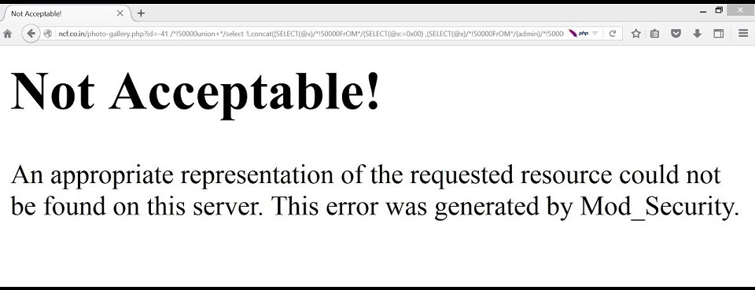

# Map Application Architecture

|ID          |
|------------|
|WSTG-INFO-10|

## Summary

The complexity of interconnected and heterogeneous web infrastructure can include hundreds of web applications and makes configuration management and review a fundamental step in testing and deploying every single application. In fact it takes only a single vulnerability to undermine the security of the entire infrastructure, and even small and seemingly unimportant problems may evolve into severe risks for another application in the same infrastructure.

To address these problems, it is of utmost importance to perform an in-depth review of configuration and known security issues. Before performing an in-depth review it is necessary to map the network and application architecture. The different elements that make up the infrastructure need to be determined to understand how they interact with a web application and how they affect security.

## Test Objectives

- Generate a map of the application at hand based on the research conducted.

## How to Test

### Map the Application Architecture

The application architecture needs to be mapped through some test to determine what different components are used to build the web application. In small setups, such as a simple PHP application, a single server might be used that serves the PHP application, and perhaps also the authentication mechanism.

On more complex setups, such as an online bank system, multiple servers might be involved. These may include a reverse proxy, a front-end web server, an application server, and a database server or LDAP server. Each of these servers will be used for different purposes and might even be segregated in different networks with firewalls between them. This creates different network zones so that access to the web server will not necessarily grant a remote user access to the authentication mechanism itself, and so that compromises of the different elements of the architecture can be isolated so that they will not compromise the whole architecture.

Getting knowledge of the application architecture can be easy if this information is provided to the testing team by the application developers in document form or through interviews, but can also prove to be very difficult if doing a blind penetration test.

In the latter case, a tester will first start with the assumption that there is a simple setup (a single server). Then they will retrieve information from other tests and derive the different elements, question this assumption, and extend the architecture map. The tester will start by asking simple questions such as: "Is there a firewall protecting the web server?". This question will be answered based on the results of network scans targeted at the web server and the analysis of whether the network ports of the web server are being filtered in the network edge (no answer or ICMP unreachables are received) or if the server is directly connected to the Internet (i.e. returns RST packets for all non-listening ports). This analysis can be enhanced to determine the type of firewall used based on network packet tests. Is it a stateful firewall or is it an access list filter on a router? How is it configured? Can it be bypassed? Is it a full fledged web application firewall?

Detecting a reverse proxy in front of the web server can be done by analysis of the web server banner, which might directly disclose the existence of a reverse proxy. It can also be determined by obtaining the answers given by the web server to requests and comparing them to the expected answers. For example, some reverse proxies act as Intrusion Prevention Systems (IPS) by blocking known attacks targeted at the web server. If the web server is known to answer with a 404 message to a request that targets an unavailable page and returns a different error message for some common web attacks like those done by vulnerability scanners, it might be an indication of a reverse proxy (or an application-level firewall) which is filtering the requests and returning a different error page than the one expected. Another example: if the web server returns a set of available HTTP methods (including TRACE) but the expected methods return errors then there is probably something in between blocking them.

In some cases, even the protection system gives itself away. Here's an example of mod_security self identifying:

\
*Figure 4.1.10-1: Example mod_security Error Page*

Reverse proxies can also be introduced as proxy-caches to accelerate the performance of back-end application servers. Detecting these proxies can be done based on the server header. They can also be detected by timing requests that should be cached by the server and comparing the time taken to server the first request with subsequent requests.

Another element that can be detected is network load balancers. Typically, these systems will balance a given TCP/IP port to multiple servers based on different algorithms (round-robin, web server load, number of requests, etc.). Thus, the detection of this architecture element needs to be done by examining multiple requests and comparing results to determine if the requests are going to the same or different web servers. For example, based on the Date header if the server clocks are not synchronized. In some cases, the network load balance process might inject new information in the headers that will make it stand out distinctly, like the BIGipServer prefixed cookie introduced by F5 BIG-IP load balancers.

Application web servers are usually easy to detect. The request for several resources is handled by the application server itself (not the web server) and the response header will vary significantly (including different or additional values in the answer header). Another way to detect these is to see if the web server tries to set cookies which are indicative of an application web server being used (such as the JSESSIONID provided by various J2EE servers), or to rewrite URLs automatically to do session tracking.

Authentication back ends (such as LDAP directories, relational databases, or RADIUS servers) however, are not as easy to detect from an external point of view in an immediate way, since they will be hidden by the application itself.

The use of a back end database can be determined simply by navigating an application. If there is highly dynamic content generated "on the fly" it is probably being extracted from some sort of database by the application itself. Sometimes the way information is requested might give insight to the existence of a database back end. For example, an online shopping application that uses numeric identifiers (`id`) when browsing the different articles in the shop. However, when doing a blind application test, knowledge of the underlying database is usually only available when a vulnerability surfaces in the application, such as poor exception handling or susceptibility to SQL injection.
