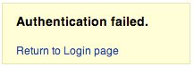
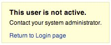

# Testing for Account Enumeration and Guessable User Account

|ID          |
|------------|
|WSTG-IDNT-04|

## Summary

The scope of this test is to verify if it is possible to collect a set of valid usernames by interacting with the authentication mechanism of the application. This test will be useful for brute force testing, in which the tester verifies if, given a valid username, it is possible to find the corresponding password.

Often, web applications reveal when a username exists on system, either as a consequence of mis-configuration or as a design decision. For example, sometimes, when we submit wrong credentials, we receive a message that states that either the username is present on the system or the provided password is wrong. The information obtained can be used by an attacker to gain a list of users on system. This information can be used to attack the web application, for example, through a brute force or default username and password attack.

The tester should interact with the authentication mechanism of the application to understand if sending particular requests causes the application to answer in different manners. This issue exists because the information released from web application or web server when the user provide a valid username is different than when they use an invalid one.

In some cases, a message is received that reveals if the provided credentials are wrong because an invalid username or an invalid password was used. Sometimes, testers can enumerate the existing users by sending a username and an empty password.

## Test Objectives

- Review processes that pertain to user identification (*e.g.* registration, login, etc.).
- Enumerate users where possible through response analysis.

## How to Test

In black-box testing, the tester knows nothing about the specific application, username, application logic, error messages on log in page, or password recovery facilities. If the application is vulnerable, the tester receives a response message that reveals, directly or indirectly, some information useful for enumerating users.

### HTTP Response Message

#### Testing for Valid Credentials

Record the server answer when you submit a valid user ID and valid password.

> Using a web proxy, notice the information retrieved from this successful authentication (HTTP 200 Response, length of the response).

#### Testing for Valid User with Wrong Password

Now, the tester should try to insert a valid user ID and a wrong password and record the error message generated by the application.

> The browser should display a message similar to the following one:
>
> \
> *Figure 4.3.4-1: Authentication Failed*
>
> Unlike any message that reveals the existence of the user like the following:
>
> `Login for User foo: invalid password`
>
> Using a web proxy, notice the information retrieved from this unsuccessful authentication attempt (HTTP 200 Response, length of the response).

#### Testing for a Nonexistent Username

Now, the tester should try to insert an invalid user ID and a wrong password and record the server answer (the tester should be confident that the username is not valid in the application). Record the error message and the server answer.

> If the tester enters a nonexistent user ID, they can receive a message similar to:
>
> \
> *Figure 4.3.4-3: This User is Not Active*
>
> or a message like the following one:
>
> `Login failed for User foo: invalid Account`
>
> Generally the application should respond with the same error message and length to the different incorrect requests. If the responses are not the same, the tester should investigate and find out the key that creates a difference between the two responses. For example:
>
> 1. Client request: Valid user/wrong password
> 2. Server response: The password is not correct
> 3. Client request: Wrong user/wrong password
> 4. Server response: User not recognized
>
> The above responses let the client understand that for the first request they have a valid username. So they can interact with the application requesting a set of possible user IDs and observing the answer.
>
> Looking at the second server response, the tester understand in the same way that they don't hold a valid username. So they can interact in the same manner and create a list of valid user ID looking at the server answers.

### Other Ways to Enumerate Users

Testers can enumerate users in several ways, such as:

#### Analyzing the Error Code Received on Login Pages

Some web application release a specific error code or message that we can analyze.

#### Analyzing URLs and URLs Re-directions

For example:

- `http://www.foo.com/err.jsp?User=baduser&Error=0`
- `http://www.foo.com/err.jsp?User=gooduser&Error=2`

As is seen above, when a tester provides a user ID and password to the web application, they see a message indication that an error has occurred in the URL. In the first case they have provided a bad user ID and bad password. In the second, a good user ID and a bad password, so they can identify a valid user ID.

#### URI Probing

Sometimes a web server responds differently if it receives a request for an existing directory or not. For instance in some portals every user is associated with a directory. If testers try to access an existing directory they could receive a web server error.

Some of the common errors received from web servers are:

- 403 Forbidden error code
- 404 Not found error code

Example:

- `http://www.foo.com/account1` - we receive from web server: 403 Forbidden
- `http://www.foo.com/account2` - we receive from web server: 404 file Not Found

In the first case the user exists, but the tester cannot view the web page, in second case instead the user "account2" does not exist. By collecting this information testers can enumerate the users.

#### Analyzing Web Page Titles

Testers can receive useful information on Title of web page, where they can obtain a specific error code or messages that reveal if the problems are with the username or password.

For instance, if a user cannot authenticate to an application and receives a web page whose title is similar to:

- `Invalid user`
- `Invalid authentication`

#### Analyzing a Message Received from a Recovery Facility

When we use a recovery facility (i.e. a forgotten password function) a vulnerable application might return a message that reveals if a username exists or not.

For example, messages similar to the following:

- `Invalid username: email address is not valid or the specified user was not found.`
- `Valid username: Your password has been successfully sent to the email address you registered with.`

#### Friendly 404 Error Message

When we request a user within the directory that does not exist, we don't always receive 404 error code. Instead, we may receive "200 ok" with an image, in this case we can assume that when we receive the specific image the user does not exist. This logic can be applied to other web server response; the trick is a good analysis of web server and web application messages.

#### Analyzing Response Times

As well as looking at the content of the responses, the time that the response take should also be considered. Particularly where the request causes an interaction with an external service (such as sending a forgotten password email), this can add several hundred milliseconds to the response, which can be used to determine whether the requested user is valid.

### Guessing Users

In some cases the user IDs are created with specific policies of administrator or company. For example we can view a user with a user ID created in sequential order:

```text
CN000100
CN000101
...
```

Sometimes the usernames are created with a REALM alias and then a sequential numbers:

- R1001 – user 001 for REALM1
- R2001 – user 001 for REALM2

In the above sample we can create simple shell scripts that compose user IDs and submit a request with tool like wget to automate a web query to discern valid user IDs. To create a script we can also use Perl and curl.

Other possibilities are: - user IDs associated with credit card numbers, or in general numbers with a pattern. - user IDs associated with real names, e.g. if Freddie Mercury has a user ID of "fmercury", then you might guess Roger Taylor to have the user ID of "rtaylor".

Again, we can guess a username from the information received from an LDAP query or from Google information gathering, for example, from a specific domain. Google can help to find domain users through specific queries or through a simple shell script or tool.

> By enumerating user accounts, you risk locking out accounts after a predefined number of failed probes (based on application policy). Also, sometimes, your IP address can be banned by dynamic rules on the application firewall or Intrusion Prevention System.

### Gray-Box Testing

#### Testing for Authentication Error Messages

Verify that the application answers in the same manner for every client request that produces a failed authentication. For this issue the black-box testing and gray-box testing have the same concept based on the analysis of messages or error codes received from web application.

> The application should answer in the same manner for every failed attempt of authentication.
>
> For Example: *Credentials submitted are not valid*

## Remediation

Ensure the application returns consistent generic error messages in response to invalid account name, password or other user credentials entered during the log in process.

Ensure default system accounts and test accounts are deleted prior to releasing the system into production (or exposing it to an untrusted network).

## Tools

- [OWASP Zed Attack Proxy (ZAP)](https://www.zaproxy.org)
- [curl](https://curl.haxx.se/)
- [PERL](https://www.perl.org)

## References

- [Marco Mella, Sun Java Access & Identity Manager Users enumeration](https://securiteam.com/exploits/5ep0f0uquo/)
- [Username Enumeration Vulnerabilities](https://www.gnucitizen.org/blog/username-enumeration-vulnerabilities/)
