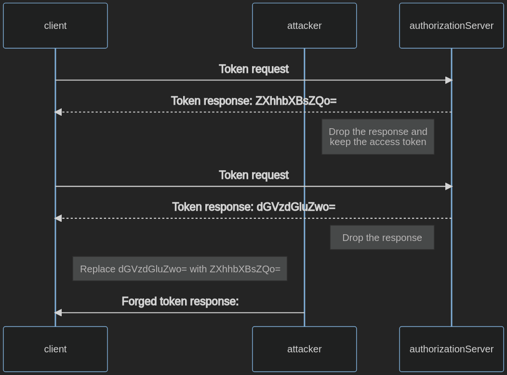

# Testing for OAuth Client Weaknesses

## Summary

OAuth grants access rights on resources to clients. This allows them to act on behalf of the resource owner. The client receives the authorization code and refresh token in the token exchange and stores them.

Failure to protect the token exchange and credentials may result in unauthorized resource access and the elevation of privileges.

## Test Objectives

- Identify weaknesses in the OAuth client.

## How to test

In order to test for client weaknesses, you will aim to:

1. Retrieve credentials used for authorization.
2. Grant yourself access to arbitrary resources through forceful browsing.
3. Bypass the authorization.

### Testing for Exposed Client Secret

The client secret is used to authenticate the client against the Authorization Server (AS) in order to prove that the client is a trusted origin.

Public clients are generally not able to store the client secret securely.

To identify the client secret in client-side code, conduct reconnaissance on the client-side code.

1. Browse to the application.
2. Open the browser's developer tools.
3. Navigate to the Debugger Tab.
4. Press Ctrl+Shift+F to open the search.
5. Search for terms similar to `client-secret` and determine if any are found.

If this is not successful, you can also:

1. Step through the authorization process with a HTTP intercepting proxy like OWASP ZAP.
2. Retrieve the client secret from the URI in the parameter `client-secret`.
3. Replace the search term in the above search with the value of the client secret and determine if it is exposed.

### Testing for Improper Token Storage

The client receives access tokens and ideally stores them in a location where those tokens can be protected from attackers.

Confidential clients should store tokens in volatile memory to prevent access through other attacks such as local file inclusion, attackers who are able to access the environment, or SQL Injection attacks.

Public clients, such as single-page applications, do not have the possibility of storing tokens securely. For example, a cross-site scripting attack allows attackers to access credentials stored in the browser.

Public clients may store tokens in the browsers session storage or in a cookie, but not in the local storage. To determine if tokens are improperly stored:

1. Browse to the application.
2. Retrieve an access token.
3. Open the browser's developer tools.
4. Navigate to the Application Tab.
5. Locate the Local Storage and view stored data.
6. Locate the Session Storage and view stored data.
7. Locate the Cookie Store and view stored data.

### Testing for Access Token Injection

This attack is only possible when the client uses a response type that directly issues an access token to the client. This occurs with the grant types Implicit Flows, Resource Owner Password Credential, and machine-to-machine flows. See [Testing for OAuth Weaknesses](05-Testing_for_OAuth_Weaknesses.md) for further description.

Access token injection is successful when an access token is leaked to an attacker and then used to authenticate with the legitimate client.

To test for access token injection, follow the steps below. In this example, the authorization token (`ZXhhbXBsZQo=`) was leaked.

1. Intercept the traffic between the client and the authorization server.
2. Start an OAuth flow with a client using the Implicit Flow grant type.
3. Inject the stolen access token:
    - Send a forged authorization response with the stolen access token (`ZXhhbXBsZQo=`) to the client.
    - Intercept a valid authorization response and replace the access token (`dGVzdGluZwo=`) with the leaked one (`ZXhhbXBsZQo=`).

\
*Figure 4.5.5.2-: Access Token Injection Flow*

## Related Test Cases

- [Testing for Cross Site Request Forgery](../06-Session_Management_Testing/05-Testing_for_Cross_Site_Request_Forgery.md)
- [Testing for Client-side URL Redirect](../11-Client-side_Testing/04-Testing_for_Client-side_URL_Redirect.md)
- [Testing JSON Web Tokens](../06-Session_Management_Testing/10-Testing_JSON_Web_Tokens.md)
- [Testing for Clickjacking](../11-Client-side_Testing/09-Testing_for_Clickjacking.md)
- [Testing Cross Origin Resource Sharing](../11-Client-side_Testing/07-Testing_Cross_Origin_Resource_Sharing.md)

## Remediation

- Use a client secret only if the client has the ability to store it securely.
- Follow best practices to store tokens securely. Treat them with the same security considerations as other credentials.
- Avoid deprecated OAuth grant types. See [Testing for OAuth Weaknesses](05-Testing_for_OAuth_Weaknesses.md) for further description.

## Tools

- [BurpSuite](https://portswigger.net/burp/releases)
- [EsPReSSO](https://github.com/portswigger/espresso)
- [OWASP ZAP](https://www.zaproxy.org/)

## References

- [User Authentication with OAuth 2.0](https://oauth.net/articles/authentication/)
- [The OAuth 2.0 Authorization Framework](https://datatracker.ietf.org/doc/html/rfc6749)
- [The OAuth 2.0 Authorization Framework: Bearer Token Usage](https://datatracker.ietf.org/doc/html/rfc6750)
- [OAuth 2.0 Threat Model and Security Considerations](https://datatracker.ietf.org/doc/html/rfc6819)
- [OAuth 2.0 Security Best Current Practice](https://datatracker.ietf.org/doc/html/draft-ietf-oauth-security-topics-16)
- [Authorization Code Flow with Proof Key for Code Exchange](https://auth0.com/docs/authorization/flows/authorization-code-flow-with-proof-key-for-code-exchange-pkce)
