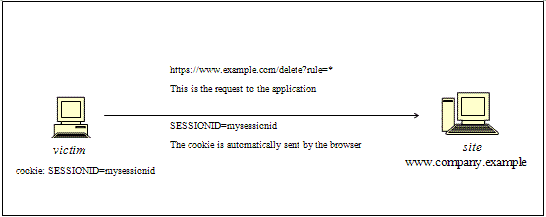
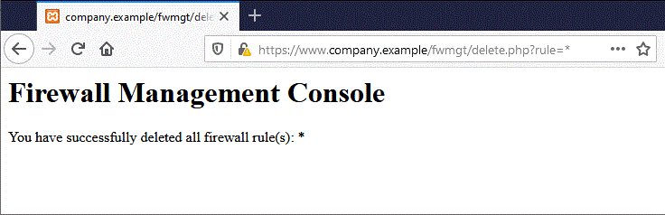

# Testing for Cross Site Request Forgery

|ID          |
|------------|
|WSTG-SESS-05|

## Summary

Cross-Site Request Forgery ([CSRF](https://owasp.org/www-community/attacks/csrf)) is an attack that forces an end user to execute unintended actions on a web application in which they are currently authenticated. With a little social engineering help (like sending a link via email or chat), an attacker may force the users of a web application to execute actions of the attacker's choosing. A successful CSRF exploit can compromise end user data and operation when it targets a normal user. If the targeted end user is the administrator account, a CSRF attack can compromise the entire web application.

CSRF relies on:

1. Web browser behavior regarding the handling of session-related information such as cookies and HTTP authentication information.
2. An attacker's knowledge of valid web application URLs, requests, or functionality.
3. Application session management relying only on information known by the browser.
4. Existence of HTML tags whose presence cause immediate access to an HTTP[S] resource; for example the image tag `img`.

Points 1, 2, and 3 are essential for the vulnerability to be present, while point 4 facilitates the actual exploitation, but is not strictly required.

1. Browsers automatically send information used to identify a user session. Suppose *site* is a site hosting a web application, and the user *victim* has just authenticated to *site*. In response, *site* sends *victim* a cookie that identifies requests sent by *victim* as belonging to *victim’s* authenticated session. Once the browser receives the cookie set by *site*, it will automatically send it along with any further requests directed to *site*.
2. If the application does not make use of session-related information in URLs, then the application URLs, their parameters, and legitimate values may be identified. This may be accomplished by code analysis or by accessing the application and taking note of forms and URLs embedded in the HTML or JavaScript.
3. "Known by the browser" refers to information such as cookies or HTTP-based authentication information (such as Basic Authentication and not form-based authentication), that are stored by the browser and subsequently present at each request directed towards an application area requesting that authentication. The vulnerabilities discussed next apply to applications that rely entirely on this kind of information to identify a user session.

For simplicity's sake, consider GET-accessible URLs (though the discussion applies as well to POST requests). If *victim* has already authenticated themselves, submitting another request causes the cookie to be automatically sent with it. The figure below illustrates the user accessing an application on `www.example.com`.

\
*Figure 4.6.5-1: Session Riding*

The GET request could be sent by the user in several different ways:

- Using the web application
- Typing the URL directly in the browser
- Following an external link that points to the URL

These invocations are indistinguishable by the application. In particular, the third may be quite dangerous. There are a number of techniques and vulnerabilities that can disguise the real properties of a link. The link can be embedded in an email message, appear in a malicious website to which the user is lured, or appear in content hosted by a third-party (such as another web site or HTML email) and point to a resource of the application. If the user clicks on the link, since they are already authenticated by the web application on *site*, the browser will issue a GET request to the web application, accompanied by authentication information (the session ID cookie). This results in a valid operation being performed on the web application that the user does not expect; for example, a funds transfer on a web banking application.

By using a tag such as `img`, as specified in point 4 above, it is not even necessary that the user follows a particular link. Suppose the attacker sends the user an email inducing them to visit a URL referring to a page containing the following (oversimplified) HTML.

```html
<html>
    <body>
...

...
    </body>
</html>
```

When the browser displays this page, it will try to display the specified zero-dimension (thus, invisible) image from `https://www.company.example` as well. This results in a request being automatically sent to the web application hosted on *site*. It is not important that the image URL does not refer to a proper image, as its presence will trigger the request `action` specified in the `src` field anyway. This happens provided that image download is not disabled in the browser. Most browsers do not have image downloads disabled since that would cripple most web applications beyond usability.

The problem here is a consequence of:

- HTML tags on the page resulting in automatic HTTP request execution (`img` being one of those).
- The browser having no way to tell that the resource referenced by `img` is not a legitimate image.
- Image loading that happens regardless of the location of the alleged image source, i.e., the form and the image itself need not be located on the same host or even the same domain.

The fact that HTML content unrelated to the web application may refer to components in the application, and the fact that the browser automatically composes a valid request towards the application, allows this kind of attack. There is no way to prohibit this behavior unless it is made impossible for the attacker to interact with application functionality.

In integrated mail/browser environments, simply displaying an email message containing the image reference would result in the execution of the request to the web application with the associated browser cookie. Email messages may reference seemingly valid image URLs such as:

```html

```

In this example, `[attacker]` is a site controlled by the attacker. By utilizing a redirect mechanism, the malicious site may use `http://[attacker]/picture.gif` to direct the victim to `http://[thirdparty]/action` and trigger the `action`.

Cookies are not the only example involved in this kind of vulnerability. Web applications whose session information is entirely supplied by the browser are vulnerable too. This includes applications relying on HTTP authentication mechanisms alone, since the authentication information is known by the browser and is sent automatically upon each request. This does not include form-based authentication, which occurs just once and generates some form of session-related information, usually a cookie.

Let’s suppose that the victim is logged on to a firewall web management console. To log in, a user has to authenticate themselves and session information is stored in a cookie.

Let's suppose the firewall web management console has a function that allows an authenticated user to delete a rule specified by its numerical ID, or all the rules in the configuration if the user specifies `*` (a dangerous feature in reality, but one that makes for a more interesting example). The delete page is shown next. Let’s suppose that the form – for the sake of simplicity – issues a GET request. To delete rule number one:

```text
https://[target]/fwmgt/delete?rule=1
```

To delete all rules:

```text
https://[target]/fwmgt/delete?rule=*
```

This example is intentionally naive, but shows in a simplified way the dangers of CSRF.

\
*Figure 4.6.5-2: Session Riding Firewall Management*

Using the form pictured in the figure above, entering the value `*` and clicking the Delete button will submit the following GET request:

```text
https://www.company.example/fwmgt/delete?rule=*
```

This would delete all firewall rules.

\
*Figure 4.6.5-3: Session Riding Firewall Management 2*

The user might also have accomplished the same results by manually submitting the URL:

```text
https://[target]/fwmgt/delete?rule=*
```

Or by following a link pointing, directly or via a redirection, to the above URL. Or, again, by accessing an HTML page with an embedded `img` tag pointing to the same URL.

In all of these cases, if the user is currently logged in to the firewall management application, the request will succeed and will modify the configuration of the firewall. One can imagine attacks targeting sensitive applications and making automatic auction bids, money transfers, orders, changing the configuration of critical software components, etc.

An interesting thing is that these vulnerabilities may be exercised behind a firewall; i.e. it is sufficient that the link being attacked be reachable by the victim and not directly by the attacker. In particular, it can be any intranet web server; for example, in the firewall management scenario mentioned before, which is unlikely to be exposed to the Internet.

Self-vulnerable applications, i.e. applications that are used both as attack vector and target (such as web mail applications), make things worse. Since users are logged in when they read their email messages, a vulnerable application of this type can allow attackers to perform actions such as deleting messages or sending messages that appear to originate from the victim.

## Test Objectives

- Determine whether it is possible to initiate requests on a user's behalf that are not initiated by the user.

## How to Test

Audit the application to ascertain if its session management is vulnerable. If session management relies only on client-side values (information available to the browser), then the application is vulnerable. "Client-side values" refers to cookies and HTTP authentication credentials (Basic Authentication and other forms of HTTP authentication; not form-based authentication, which is an application-level authentication).

Resources accessible via HTTP GET requests are easily vulnerable, though POST requests can be automated via JavaScript and are vulnerable as well; therefore, the use of POST alone is not enough to correct the occurrence of CSRF vulnerabilities.

In case of POST, the following sample can be used.

1. Create an HTML page similar to that shown below
2. Host the HTML on a malicious or third-party site
3. Send the link for the page to the victim(s) and induce them to click it.

```html
<html>
<body onload='document.CSRF.submit()'>

<form action='http://targetWebsite/Authenticate.jsp' method='POST' name='CSRF'>
    <input type='hidden' name='name' value='Hacked'>
    <input type='hidden' name='password' value='Hacked'>
</form>

</body>
</html>
```

In case of web applications in which developers are utilizing JSON for browser to server communication, a problem may arise with the fact that there are no query parameters with the JSON format, which are a must with self-submitting forms. To bypass this case, we can use a self-submitting form with JSON payloads including hidden input to exploit CSRF. We'll have to change the encoding type (`enctype`) to `text/plain` to ensure the payload is delivered as-is. The exploit code will look like the following:

```html
<html>
 <body>
  <script>history.pushState('', '', '/')</script>
   <form action='http://victimsite.com' method='POST' enctype='text/plain'>
     <input type='hidden' name='{"name":"hacked","password":"hacked","padding":"'value='something"}' />
     <input type='submit' value='Submit request' />
   </form>
 </body>
</html>
```

The POST request will be as follow:

```http
POST / HTTP/1.1
Host: victimsite.com
Content-Type: text/plain

{"name":"hacked","password":"hacked","padding":"=something"}
```

When this data is sent as a POST request, the server will happily accept the name and password fields and ignore the one with the name padding as it does not need it.

## Remediation

- See the [OWASP CSRF Prevention Cheat Sheet](https://cheatsheetseries.owasp.org/cheatsheets/Cross-Site_Request_Forgery_Prevention_Cheat_Sheet.html) for prevention measures.

## Tools

- [OWASP ZAP](https://www.zaproxy.org/)
- [CSRF Tester](https://wiki.owasp.org/index.php/Category:OWASP_CSRFTester_Project)
- [Pinata-csrf-tool](https://code.google.com/archive/p/pinata-csrf-tool/)

## References

- [Peter W: "Cross-Site Request Forgeries"](https://web.archive.org/web/20160303230910/http://www.tux.org/~peterw/csrf.txt)
- [Thomas Schreiber: "Session Riding"](https://web.archive.org/web/20160304001446/http://www.securenet.de/papers/Session_Riding.pdf)
- [Oldest known post](https://web.archive.org/web/20000622042229/http://www.zope.org/Members/jim/ZopeSecurity/ClientSideTrojan)
- [Cross-site Request Forgery FAQ](https://www.cgisecurity.com/csrf-faq.html)
- [A Most-Neglected Fact About Cross Site Request Forgery (CSRF)](http://yehg.net/lab/pr0js/view.php/A_Most-Neglected_Fact_About_CSRF.pdf)
- [Multi-POST CSRF](https://www.lanmaster53.com/2013/07/17/multi-post-csrf/)
- [SANS Pen Test Webcast: Complete Application pwnage via Multi POST XSRF](https://www.youtube.com/watch?v=EOs5PZiiwug)
