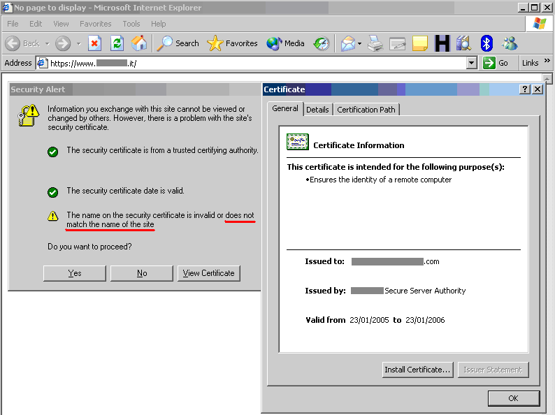
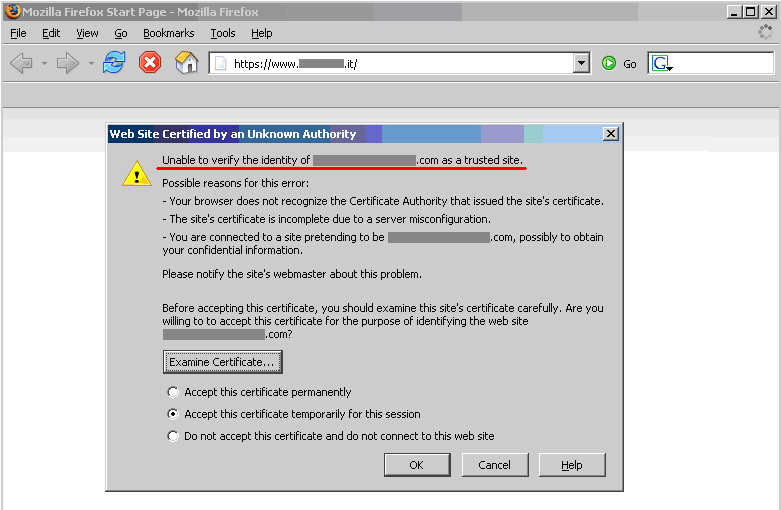

# Testing for Weak SSL TLS Ciphers Insufficient Transport Layer Protection

|ID          |
|------------|
|WSTG-CRYP-01|

## Summary

Sensitive data must be protected when it is transmitted through the network. Such data can include user credentials and credit cards. As a rule of thumb, if data must be protected when it is stored, it must be protected also during transmission.

HTTP is a clear-text protocol and it is normally secured via an SSL/TLS tunnel, resulting in [HTTPS traffic](https://tools.ietf.org/html/rfc8446). The use of this protocol ensures not only confidentiality, but also authentication. Servers are authenticated using digital certificates and it is also possible to use client certificate for mutual authentication.

Even if high grade ciphers are today supported and normally used, some misconfiguration in the server can be used to force the use of a weak cipher - or at worst no encryption - permitting to an attacker to gain access to the supposed secure communication channel. Other misconfiguration can be used for a Denial of Service attack.

## Common Issues

Transport layer security related issues can be broadly split into the following areas:

### Server Configuration

There are a large number of protocol versions, ciphers and extensions supported by TLS. Many of these are considered to be legacy, and have cryptographic weaknesses, such as those listed below. Note that new weaknesses are likely to be identified over time, so this list may be incomplete.

* SSLv2 (DROWN)
* SSLv3 (POODLE)
* TLSv1.0 (BEAST)
* EXPORT ciphers
* NULL ciphers
* Anonymous ciphers
* RC4 ciphers (NOMORE)
* CBC mode ciphers (BEAST, Lucky 13)
* TLS compression (CRIME)
* Weak DHE keys (LOGJAM)

#### Exploitability

It should be emphasised that while many of these attacks have been demonstrated in a lab environment, they are not generally considered practical to exploit in the real world, as they require a (usually active) man-in-the-middle attack, and significant resources. As such, they are unlikely to be exploited by anyone other than nation states.

### Digital Certificates

### Implementation Vulnerabilities

### Application Vulnerabilities

### Sensitive Data Transmitted in Clear-Text

The application should not transmit sensitive information via unencrypted channels. Typically it is possible to find basic authentication over HTTP, input password or session cookie sent via HTTP and, in general, other information considered by regulations, laws or organization policy.

### TLS/SSL Certificate Validity – Client and Server

When accessing a web application via the HTTPS protocol, a secure channel is established between the client and the server. The identity of one (the server) or both parties (client and server) is then established by means of digital certificates. So, once the cipher suite is determined, the “SSL Handshake” continues with the exchange of the certificates:

1. The server sends its Certificate message and, if client authentication is required, also sends a CertificateRequest message to the client.
2. The server sends a ServerHelloDone message and waits for a client response.
3. Upon receipt of the ServerHelloDone message, the client verifies the validity of the server's digital certificate.

In order for the communication to be set up, a number of checks on the certificates must be passed. While discussing SSL and certificate based authentication is beyond the scope of this guide, this section will focus on the main criteria involved in ascertaining certificate validity:

- Checking if the Certificate Authority (CA) is a known one (meaning one considered trusted);
- Checking that the certificate is currently valid;
- Checking that the name of the site and the name reported in the certificate match.

Let's examine each check more in detail.

- Each browser comes with a pre-loaded list of trusted CAs, against which the certificate signing CA is compared (this list can be customized and expanded at will). During the initial negotiations with an HTTPS server, if the server certificate relates to a CA unknown to the browser, a warning is usually raised. This happens most often because a web application relies on a certificate signed by a self-established CA. Whether this is to be considered a concern depends on several factors. For example, this may be fine for an Intranet environment (think of corporate web email being provided via HTTPS; here, obviously all users recognize the internal CA as a trusted CA). When a service is provided to the general public via the Internet, however (i.e. when it is important to positively verify the identity of the server we are talking to), it is usually imperative to rely on a trusted CA, one which is recognized by all the user base (and here we stop with our considerations; we won’t delve deeper in the implications of the trust model being used by digital certificates).
- Certificates have an associated period of validity, therefore they may expire. Again, we are warned by the browser about this. A public service needs a temporally valid certificate; otherwise, it means we are talking with a server whose certificate was issued by someone we trust, but has expired without being renewed.
- What if the name on the certificate and the name of the server do not match? If this happens, it might sound suspicious. For a number of reasons, this is not so rare to see. A system may host a number of name-based virtual hosts, which share the same IP address and are identified by means of the HTTP 1.1 Host: header information. In this case, since the SSL handshake checks the server certificate before the HTTP request is processed, it is not possible to assign different certificates to each virtual server. Therefore, if the name of the site and the name reported in the certificate do not match, we have a condition which is typically signaled by the browser. To avoid this, IP-based virtual servers must be used. [sslyze](https://github.com/nabla-c0d3/sslyze) and [RFC: TLS Extensions](https://www.ietf.org/rfc/rfc6066.txt) describe techniques to deal with this problem and allow name-based virtual hosts to be correctly referenced.

### Other Vulnerabilities

The presence of a new service, listening in a separate tcp port may introduce vulnerabilities such as infrastructure vulnerabilities if the [software is not up to date](../02-Configuration_and_Deployment_Management_Testing/01-Test_Network_Infrastructure_Configuration.md). Furthermore, for the correct protection of data during transmission the Session Cookie must use the [Secure flag](../06-Session_Management_Testing/02-Testing_for_Cookies_Attributes.md) and some directives should be sent to the browser to accept only secure traffic (e.g. [HSTS](../02-Configuration_and_Deployment_Management_Testing/07-Test_HTTP_Strict_Transport_Security.md), CSP).

Also there are some attacks that can be used to intercept traffic if the web server exposes the application on both [HTTP](../02-Configuration_and_Deployment_Management_Testing/07-Test_HTTP_Strict_Transport_Security.md) and [HTTPS](https://resources.enablesecurity.com/resources/Surf%20Jacking.pdf) or in case of mixed HTTP and HTTPS resources in the same page.

## How to Test

### Testing for Weak SSL/TLS Ciphers/Protocols/Keys Vulnerabilities

The large number of available cipher suites and quick progress in cryptanalysis makes testing an SSL server a non-trivial task.

At the time of writing these criteria are widely recognized as minimum checklist:

- Renegotiation must be properly configured (e.g. Insecure Renegotiation must be disabled, due to [MiTM attacks](https://cve.mitre.org/cgi-bin/cvename.cgi?name=CVE-2009-3555) and Client-initiated Renegotiation must be disabled, due to [Denial of Service vulnerability](https://community.qualys.com/blogs/securitylabs/2011/10/31/tls-renegotiation-and-denial-of-service-attacks)).
- X.509 certificates key length must be strong (e.g. if RSA or DSA is used the key must be at least 1024 bits).
- X.509 certificates must be signed only with secure hashing algoritms (e.g. not signed using MD5 hash, due to known collision attacks on this hash).
- [Keys must be generated with proper entropy](https://www.ssllabs.com/projects/rating-guide/index.html) (e.g, Weak Key Generated with Debian).

A more complete checklist includes:

- Secure Renegotiation should be enabled.
- MD5 should not be used, due to [known collision attacks](https://link.springer.com/chapter/10.1007/11426639_2).
- RC4 should not be used, due to [crypto-analytical attacks](https://community.qualys.com/blogs/securitylabs/2013/03/19/rc4-in-tls-is-broken-now-what).
- Server should be protected from [BEAST Attack](https://community.qualys.com/blogs/securitylabs/2011/10/17/mitigating-the-beast-attack-on-tls).
- Server should be protected from [CRIME attack](https://community.qualys.com/blogs/securitylabs/2012/09/14/crime-information-leakage-attack-against-ssltls), TLS compression must be disabled.
- Server should support [Forward Secrecy](https://community.qualys.com/blogs/securitylabs/2013/06/25/ssl-labs-deploying-forward-secrecy).

The following standards can be used as reference while assessing SSL servers:

- [PCI-DSS](https://www.pcisecuritystandards.org/security_standards/documents.php) requires compliant parties to use “strong cryptography” without precisely defining key lengths and algorithms. Common interpretation, partially based on previous versions of the standard, is that at least 128 bit key cipher, no export strength algorithms and no SSLv2 should be used.
- [Qualsys SSL Labs Server Rating Guide](https://www.ssllabs.com/projects/rating-guide/index.html), [Deployment best practice](https://www.ssllabs.com/projects/best-practices/index.html), and [SSL Threat Model](https://www.ssllabs.com/projects/ssl-threat-model/index.html) has been proposed to standardize SSL server assessment and configuration. But is less updated than the [SSL Server tool](https://www.ssllabs.com/ssltest/index.html).
- OWASP has a lot of resources about SSL/TLS Security:
  - [Transport Layer Protection Cheat Sheet](https://cheatsheetseries.owasp.org/cheatsheets/Transport_Layer_Protection_Cheat_Sheet.html).
  - [OWASP Top 10 2017 A3-Sensitive Data Exposure](https://owasp.org/www-project-top-ten/OWASP_Top_Ten_2017/Top_10-2017_A3-Sensitive_Data_Exposure).
  - [OWASP ASVS - Verification V9](https://github.com/OWASP/ASVS/blob/master/4.0/en/0x17-V9-Communications.md).
  - [OWASP Application Security FAQ - Cryptography/SSL](https://owasp.org/www-community/OWASP_Application_Security_FAQ#cryptographyssl).

Some tools and scanners both free (e.g. [SSLScan](https://sourceforge.net/projects/sslscan/)) and commercial (e.g. [Tenable Nessus](https://www.tenable.com/products/nessus)), can be used to assess SSL/TLS vulnerabilities. But due to evolution of these vulnerabilities a good way to test is to check them manually with [OpenSSL](https://www.openssl.org/) or use the tool’s output as an input for manual evaluation using the references.

Sometimes the SSL/TLS enabled service is not directly accessible and the tester can access it only via a HTTP proxy using [CONNECT method](https://tools.ietf.org/html/rfc2817). Most of the tools will try to connect to desired tcp port to start SSL/TLS handshake. This will not work since desired port is accessible only via HTTP proxy. The tester can easily circumvent this by using relaying software such as [socat](https://linux.die.net/man/1/socat).

### Testing SSL Certificate Validity – Client and Server

Firstly upgrade the browser because CA certs expire and in every release of the browser these are renewed. Examine the validity of the certificates used by the application. Browsers will issue a warning when encountering expired certificates, certificates issued by untrusted CAs, and certificates which do not match name wise with the site to which they should refer.

By clicking on the padlock that appears in the browser window when visiting an HTTPS site, testers can look at information related to the certificate – including the issuer, period of validity, encryption characteristics, etc. If the application requires a client certificate, that tester has probably installed one to access it. Certificate information is available in the browser by inspecting the relevant certificate(s) in the list of the installed certificates.

These checks must be applied to all visible SSL-wrapped communication channels used by the application. Though this is the usual HTTPS service running on port 443, there may be additional services involved depending on the web application architecture and on deployment issues (an HTTPS administrative port left open, HTTPS services on non-standard ports, etc.). Therefore, apply these checks to all SSL-wrapped ports which have been discovered. For example, the nmap scanner features a scanning mode (enabled by the `–sV` command-line switch) which identifies SSL-wrapped services. The Nessus vulnerability scanner has the capability of performing SSL checks on all SSL/TLS-wrapped services.

#### Example 1. Testing for Certificate Validity (Manually)

Rather than providing a fictitious example, this guide includes an anonymized real-life example to stress how frequently one stumbles on HTTPS sites whose certificates are inaccurate with respect to naming. The following screenshots refer to a regional site of a high-profile IT company.

We are visiting a .it site and the certificate was issued to a .com site. Internet Explorer warns that the name on the certificate does not match the name of the site.

 \
*Figure 4.9.1-1: Warning issued by Microsoft Internet Explorer*

The message issued by Firefox is different. Firefox complains because it cannot ascertain the identity of the .com site the certificate refers to because it does not know the CA which signed the certificate. In fact, Internet Explorer and Firefox do not come pre-loaded with the same list of CAs. Therefore, the behavior experienced with various browsers may differ.

 \
*Figure 4.9.1-2: Warning issued by Mozilla Firefox*

### Testing for Other Vulnerabilities

As mentioned previously, there are other types of vulnerabilities that are not related with the SSL/TLS protocol used, the cipher suites or Certificates. Apart from other vulnerabilities discussed in other parts of this guide, a vulnerability exists when the server provides the website both with the HTTP and HTTPS protocols, and permits an attacker to force a victim into using a non-secure channel instead of a secure one.

#### Surf Jacking

The [Surf Jacking attack](https://resources.enablesecurity.com/resources/Surf%20Jacking.pdf) was first presented by Sandro Gauci and permits to an attacker to hijack an HTTP session even when the victim’s connection is encrypted using SSL or TLS.

The following is a scenario of how the attack can take place:

- Victim logs into the secure website at `https://somesecuresite/`.
- The secure site issues a session cookie as the client logs in.
- While logged in, the victim opens a new browser window and goes to `http://examplesite/`
- An attacker sitting on the same network is able to see the clear text traffic to `http://examplesite`.
- The attacker sends back a `301 Moved Permanently` in response to the clear text traffic to `http://examplesite`. The response contains the header `Location: http://somesecuresite/`, which makes it appear that examplesite is sending the web browser to somesecuresite. Notice that the URL scheme is HTTP not HTTPS.
- The victim's browser starts a new clear text connection to `http://somesecuresite/` and sends an HTTP request containing the cookie in the HTTP header in clear text
- The attacker sees this traffic and logs the cookie for later use.

To test if a website is vulnerable carry out the following tests:

1. Check if website supports both HTTP and HTTPS protocols
2. Check if cookies do not have the `Secure` flag

#### SSL Strip

Some applications supports both HTTP and HTTPS, either for usability or so users can type both addresses and get to the site. Often users go into an HTTPS website from link or a redirect. Typically personal banking sites have a similar configuration with an iframed log in or a form with action attribute over HTTPS but the page under HTTP.

An attacker in a privileged position - as described in [SSL strip](https://github.com/moxie0/sslstrip) - can intercept traffic when the user is in the HTTP site and manipulate it to get a Manipulator-In-The-Middle attack under HTTPS. An application is vulnerable if it supports both HTTP and HTTPS.

### Testing via HTTP Proxy

Inside corporate environments testers can see services that are not directly accessible and they can access them only via HTTP proxy using the [CONNECT method](https://tools.ietf.org/html/rfc2817). Most of the tools will not work in this scenario because they try to connect to the desired tcp port to start the SSL/TLS handshake. With the help of relaying software such as [socat](https://linux.die.net/man/1/socat) testers can enable those tools for use with services behind an HTTP proxy.

#### Example 1. Testing via HTTP Proxy

To connect to `destined.application.lan:443` via proxy `10.13.37.100:3128` run `socat` as follows:

`$ socat TCP-LISTEN:9999,reuseaddr,fork PROXY:10.13.37.100:destined.application.lan:443,proxyport=3128`

Then the tester can target all other tools to `localhost:9999`:

`$ openssl s_client -connect localhost:9999`

All connections to `localhost:9999` will be effectively relayed by socat via proxy to `destined.application.lan:443`.

## Configuration Review

### Testing for Weak SSL/TLS Cipher Suites

Check the configuration of the web servers that provide HTTPS services. If the web application provides other SSL/TLS wrapped services, these should be checked as well.

#### Example 1. Windows Server

Check the configuration on a Microsoft Windows Server (2000, 2003 and 2008) using the registry key:

`HKEY_LOCAL_MACHINE\SYSTEM\CurrentControlSet\Control\SecurityProviders\SCHANNEL\`

that has some sub-keys including Ciphers, Protocols and KeyExchangeAlgorithms.

#### Example 2. Apache

To check the cipher suites and protocols supported by the Apache2 web server, open the `ssl.conf` file and search for the `SSLCipherSuite`, `SSLProtocol`, `SSLHonorCipherOrder`,`SSLInsecureRenegotiation` and `SSLCompression` directives.

### Testing SSL Certificate Validity – Client and Server Review

Examine the validity of the certificates used by the application at both server and client levels. The usage of certificates is primarily at the web server level, however, there may be additional communication paths protected by SSL (for example, towards the DBMS). Testers should check the application architecture to identify all SSL protected channels.
