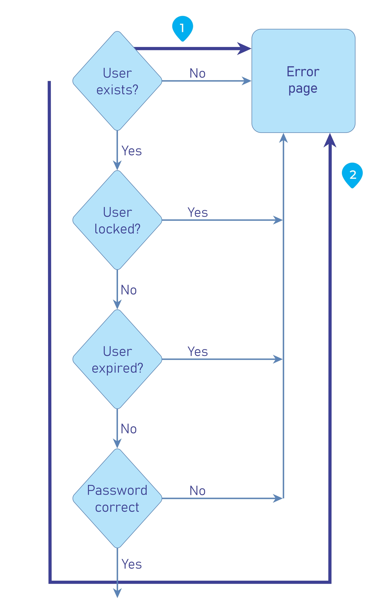

# Test for Process Timing

|ID          |
|------------|
|WSTG-BUSL-04|

## Summary

It is possible that attackers can gather information on an application by monitoring the time it takes to complete a task or give a respond. Additionally, attackers may be able to manipulate and break designed business process flows by simply keeping active sessions open and not submitting their transactions in the "expected" time frame.

Process timing logic vulnerabilities is unique in that these manual misuse cases should be created considering execution and transaction timing that are application/system specific.

Processing timing may give/leak information on what is being done in the application/system background processes. If an application allows users to guess what the particulate next outcome will be by processing time variations, users will be able to adjust accordingly and change behavior based on the expectation and "game the system".

### Example 1

Video gambling/slot machines may take longer to process a transaction just prior to a large payout. This would allow astute gamblers to gamble minimum amounts until they see the long process time which would then prompt them to bet the maximum.

### Example 2

Many system log on processes ask for the username and password. If you look closely you may be able to see that entering an invalid username and invalid user password takes more time to return an error than entering a valid username and invalid user password. This may allow the attacker to know if they have a valid username and not need to rely on the GUI message.

\
*Figure 4.10.4-1: Example Control Flow of Login Form*

### Example 3

Most Arenas or travel agencies have ticketing applications that allow users to purchase tickets and reserve seats. When the user requests the tickets seats are locked or reserved pending payment. What if an attacker keeps reserving seats but not checking out? Will the seats be released, or will no tickets be sold? Some ticket vendors now only allow users 5 minutes to complete a transaction or the transaction is invalidated.

### Example 4

Suppose a precious metals e-commerce site allows users to make purchases with a price quote based on market price at the time they log on. What if an attacker logs on and places an order but does not complete the transaction until later in the day only of the price of the metals goes up? Will the attacker get the initial lower price?

## Test Objectives

- Review the project documentation for system functionality that may be impacted by time.
- Develop and execute misuse cases.

## How to Test

The tester should identify which processes are dependent on time, whether it was a window for a task to be completed, or if it was execution time between two processes that could allow the bypass of certain controls.

Following that, it is best to automate the requests that will abuse the above discovered processes, as tools are better fit to analyze the timing and are more precise than manual testing. If this is not possible, manual testing could still be used.

The tester should draw a diagram of how the process flows, the injection points, and prepare the requests before hand to launch them at the vulnerable processes. Once done, close analysis should be done to identify differences in the process execution, and if the process is misbehaving against the agreed upon business logic.

## Related Test Cases

- [Testing for Cookies Attributes](../06-Session_Management_Testing/02-Testing_for_Cookies_Attributes.md)
- [Test Session Timeout](../06-Session_Management_Testing/07-Testing_Session_Timeout.md)

## Remediation

Develop applications with processing time in mind. If attackers could possibly gain some type of advantage from knowing the different processing times and results add extra steps or processing so that no matter the results they are provided in the same time frame.

Additionally, the application/system must have mechanism in place to not allow attackers to extend transactions over an "acceptable" amount of time. This may be done by canceling or resetting transactions after a specified amount of time has passed like some ticket vendors are now using.
