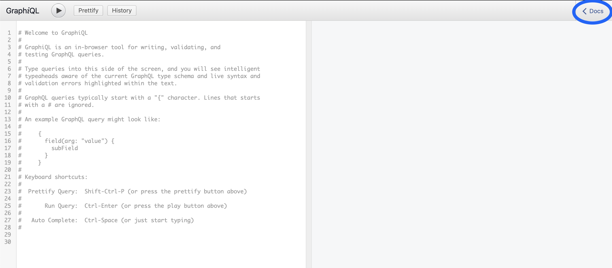

# Testing GraphQL

|ID          |
|------------|
|WSTG-API-01|

## Summary

GraphQL has become very pouplar in modern APIs. It provides simplicty, and nested objects, which allows developers for faster development.  
Every techonolgy, while having advantages can also expose the application to new attack srufaces.
The purpose of this guide is to provide some common misconfigurations and attack vectors on applications which utilize GraphQL.  
Some vectors are unique to GraphQL (Introspection Query for example) and some are not (SQL Injection for example).

The guide will use a demo vulnerable application which uses GraphQL for the API access in order to demonstrate vulnerable a GraphQL node.

The guide will be based on a vulnerable GraphQL application [poc-graphql](https://github.com/righettod/poc-graphql), which is run in a docker container which maps localhost:8080/graphql as the vulnerable GraphQL node.

## Test Objectives

Assess GraphQL's security configuration, as well as other common vulnerabilities which might affect GraphQL deployments.

## How to Test

Testing GraphQL nodes is not very different than testing other API technologies. This Guide suggests following these steps:

### Introspection Queries

A little bit of background:  
Introspection queries are the way GraphQL lets you ask it what queries it supports. This is a good starting point on the information garthering phase.

There are a couple of ways to extract that and visualise the output:

#### Using Native GrapQL Introspection

The most straight-forward way is to send an HTTP request (using a proxy liek Burp) with the following payload :

~~~~
query IntrospectionQuery {
  __schema {
    queryType {
      name
    }
    mutationType {
      name
    }
    subscriptionType {
      name
    }
    types {
      ...FullType
    }
    directives {
      name
      description
      locations
      args {
        ...InputValue
      }
    }
  }
}
fragment FullType on __Type {
  kind
  name
  description
  fields(includeDeprecated: true) {
    name
    description
    args {
      ...InputValue
    }
    type {
      ...TypeRef
    }
    isDeprecated
    deprecationReason
  }
  inputFields {
    ...InputValue
  }
  interfaces {
    ...TypeRef
  }
  enumValues(includeDeprecated: true) {
    name
    description
    isDeprecated
    deprecationReason
  }
  possibleTypes {
    ...TypeRef
  }
}
fragment InputValue on __InputValue {
  name
  description
  type {
    ...TypeRef
  }
  defaultValue
}
fragment TypeRef on __Type {
  kind
  name
  ofType {
    kind
    name
    ofType {
      kind
      name
      ofType {
        kind
        name
        ofType {
          kind
          name
          ofType {
            kind
            name
            ofType {
              kind
              name
              ofType {
                kind
                name
              }
            }
          }
        }
      }
    }
  }
}
~~~~

The result will usually be very long (and hence will be shorted here), and it will contain the entire scheme of the GraphQL deployment.  

Response:

```
{
  "data": {
    "__schema": {
      "queryType": {
        "name": "Query"
      },
      "mutationType": {
        "name": "Mutation"
      },
      "subscriptionType": {
        "name": "Subscription"
      },
      "types": [
        {
          "kind": "ENUM",
          "name": "__TypeKind",
          "description": "An enum describing what kind of type a given __Type is",
          "fields": null,
          "inputFields": null,
          "interfaces": null,
          "enumValues": [
            {
              "name": "SCALAR",
              "description": "Indicates this type is a scalar.",
              "isDeprecated": false,
              "deprecationReason": null
            },
            {
              "name": "OBJECT",
              "description": "Indicates this type is an object. `fields` and `interfaces` are valid fields.",
              "isDeprecated": false,
              "deprecationReason": null
            },
            {
              "name": "INTERFACE",
              "description": "Indicates this type is an interface. `fields` and `possibleTypes` are valid fields.",
              "isDeprecated": false,
              "deprecationReason": null
            },
            {
              "name": "UNION",
              "description": "Indicates this type is a union. `possibleTypes` is a valid field.",
              "isDeprecated": false,
              "deprecationReason": null
            },
            {
              "name": "ENUM",
              "description": "Indicates this type is an enum. `enumValues` is a valid field.",
              "isDeprecated": false,
              "deprecationReason": null
            },
            {
              "name": "INPUT_OBJECT",
              "description": "Indicates this type is an input object. `inputFields` is a valid field.",
              "isDeprecated": false,
              "deprecationReason": null
            },
            {
              "name": "LIST",
              "description": "Indicates this type is a list. `ofType` is a valid field.",
              "isDeprecated": false,
              "deprecationReason": null
            },
            {
              "name": "NON_NULL",
              "description": "Indicates this type is a non-null. `ofType` is a valid field.",
              "isDeprecated": false,
              "deprecationReason": null
            }
          ],
          "possibleTypes": null
                ...
        {
```

Now use GraphQL Voyager to get a better look on the output:


This tool creates an ERD representation of the GraphQL scheme, allowing you to get a better look into the moving parts of the system you're testing.  
Extracting information from the drawing allows you to see you can query the dogs table for example. It also shows which properties a "dog" has:

* id
* name
* vertrinary (id)  

There is one downside to using this method, GraphQL Voyager does not display everything that can be done with GraphQL, for example, in the drwaing above the mutations avilable are not listed, so the best way would be to use both Voyager and one of the methods listed below.

#### Using the GraphiQL

Graphiql is a web-based IDE for GraphQL. It is part of the GraphQL project, and it is mainly used for debugging or development purposes.  
The best practice is to not allow users to access it on production deployments, however, if you are testing a staging enviornment you might have access to it and it can save you some time playing around with introspeciton queries (although you can, of course, use introspection in the GraphiQL inteface).  

The GraphiQL has a docs section, which uses the data from the scheme in order to created a documentation of the GraphQL instance that is being used.




The documentation contains the data types, mutations, and basiaclly every piece of information you can extract using Introspection.

#### Using GraphQL Playgrounds

GraphQL Playgrounds is a GraphQL client, which can be used to test different queries, as well as dividing GraphQL IDEs into different playgrounds, grouped by theme or by assigning a name to them.  
Much like GraphiQL Playgrounds can create the documentation for you, without the need to manually sending introspection and processing the response but with one great advantage, it doesn't need GraphiQL interface to be avilable.  
Another upside for this tool, is that it works just by directing the tool to the GraphQL node via a URL (there is also the option of using it locally with the data file) and then the magic happens without any user interaction.  
Another advantage of the tool is that it can be used to test for vulnerabilities directly, you don't need to use a proxy to send HTTP requests (Burp for example), and so you can use this tool in order to manually plat with GraphQL and use Burp for other, more advanced payloads.


You can even download the schemes to use in Voygaer.

#### Introspection Conclusion

Introspection is a useful tool which allows users to gain more information about the GraphQL deployment, however, this will also allow mallicious users to gain access to the same information.  
The best practice is to limit the access to the introspection queries, since, some tools or reqeusts might fail if this feature is disabled altogether.  
Since GraphQL is usually bridges to the backend APIs of the system, its better to enforce strict access control, which leads to the next topic.

### Access Control

TALK ABOUT ACCESS CONTROL

## Remediation

1. Restrict access to introspection queries.

## Tools

* [GraphQL Playground](https://github.com/prisma-labs/graphql-playground)

### Burp GraphQL Extensions

* [InQL](https://portswigger.net/bappstore/296e9a0730384be4b2fffef7b4e19b1f)
* [GraphQL Raider](https://portswigger.net/bappstore/4841f0d78a554ca381c65b26d48207e6)

### Zap Proxy Extensions

* [GraphQL addon for (OWASP) ZAP](https://www.zaproxy.org/blog/2020-08-28-introducing-the-graphql-add-on-for-zap/)

## References

* [poc-graphql](https://github.com/righettod/poc-graphql)
* [GraphQL Offical Site](https://graphql.org/learn/)
