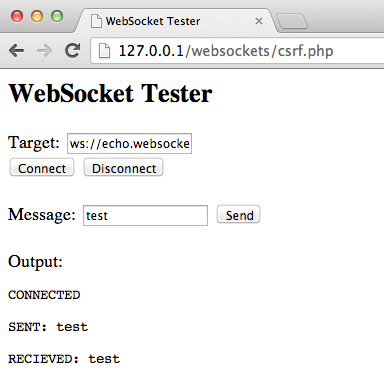

# Testing WebSockets

## Summary

Traditionally, the HTTP protocol only allows one request/response per TCP connection. Asynchronous JavaScript and XML (AJAX) allows clients to send and receive data asynchronously (in the background without a page refresh) to the server, however, AJAX requires the client to initiate the requests and wait for the server responses (half-duplex).

[WebSockets](https://html.spec.whatwg.org/multipage/web-sockets.html#network) allow the client or server to create a 'full-duplex' (two-way) communication channel, allowing the client and server to truly communicate asynchronously. WebSockets conduct their initial *upgrade* handshake over HTTP and from then on all communication is carried out over TCP channels by use of frames. For more, see the [WebSocket Protocol](https://tools.ietf.org/html/rfc6455).

## Origin

It is the server’s responsibility to verify the [`Origin` header](https://developer.mozilla.org/en-US/docs/Web/HTTP/Headers/Origin) in the initial HTTP WebSocket handshake. If the server does not validate the origin header in the initial WebSocket handshake, the WebSocket server may accept connections from any origin. This could allow attackers to communicate with the WebSocket server cross-domain allowing for CSRF-like issues. See also [Top 10-2017 A5-Broken Access Control](https://www.owasp.org/index.php/Top_10-2017_A5-Broken_Access_Control).

## Confidentiality and Integrity

WebSockets can be used over unencrypted TCP or over encrypted TLS. To use unencrypted WebSockets the `ws://` URI scheme is used (default port 80), to use encrypted (TLS) WebSockets the `wss://` URI scheme is used (default port 443). See also [Top 10-2017 A3-Sensitive Data Exposure](https://www.owasp.org/index.php/Top_10-2017_A3-Sensitive_Data_Exposure).

## Input Sanitization

As with any data originating from untrusted sources, the data should be properly sanitized and encoded. See also [Top 10-2017 A1-Injection](https://www.owasp.org/index.php/Top_10-2017_A1-Injection) and [Top 10-2017 A7-Cross-Site Scripting (XSS)](https://www.owasp.org/index.php/Top_10-2017_A7-Cross-Site_Scripting_(XSS)).

## How to Test

The following describes how to test for WebSocket vulnerabilities.

### 1. Determine if the Application is Using WebSockets

- Inspect the client-side source code for the `ws://` or `wss://` URI scheme.
- Use Google Chrome's Developer Tools to view the Network WebSocket communication.
- Use [OWASP Zed Attack Proxy](https://www.owasp.org/index.php/OWASP_Zed_Attack_Proxy_Project) (ZAP)'s WebSocket tab.

### 2. Attempt to Connect to the Remote Server

Using a WebSocket client such as [Simple WebSocket Client](https://chrome.google.com/webstore/detail/simple-websocket-client/pfdhoblngboilpfeibdedpjgfnlcodoo) or [ethicalhack3r's WebSocket Client script](https://github.com/ethicalhack3r/scripts/blob/master/WebSockets.html), attempt to connect to the remote WebSocket server. If a connection is established, the server may not be checking the origin header of the WebSocket handshake.

### 3. Examine Confidentiality and Integrity

- Check that the WebSocket connection is using SSL to transport sensitive information via the `wss://` URI scheme.
- Check the SSL implementation for security issues (Valid Certificate, BEAST, CRIME, RC4, etc). Refer to the [Testing for Weak SSL/TLS Ciphers, Insufficient Transport Layer Protection (OTG-CRYPST-001)](https://www.owasp.org/index.php/Testing_for_Weak_SSL/TLS_Ciphers,_Insufficient_Transport_Layer_Protection_(OTG-CRYPST-001)) section of this guide.

### 4. Use a Testing Tool

Use a testing tool such as the [OWASP Zed Attack Proxy (ZAP)](https://www.owasp.org/index.php/OWASP_Zed_Attack_Proxy_Project) to intercept the WebSocket request and responses. ZAP can then be used to replay and fuzz the WebSocket request/responses.

Testers may use a WebSocket client to attempt to replay requests previously intercepted to verify that cross-domain WebSocket communication is possible. Construct custom WebSocket requests and handle responses to directly test WebSocket services.

