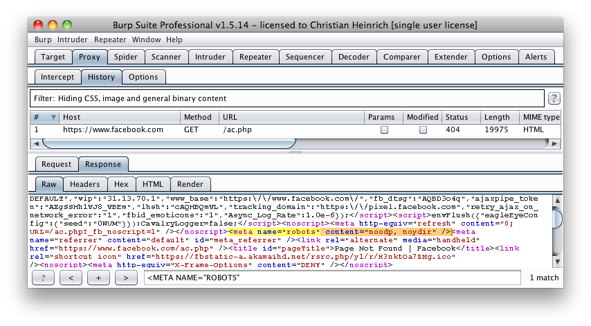

# Review Webserver Metafiles for Information Leakage

## Summary

This section describes how to test the robots.txt file for information leakage of the web application's directory or folder path(s). Furthermore, the list of directories that are to be avoided by Spiders, Robots, or Crawlers can also be created as a dependency for [Map execution paths through application (OTG-INFO-007)](4.2.7_Map_Execution_Paths_Through_Application_OTG-INFO-007.md)

## Test Objectives

1. Information leakage of the web application's directory or folder path(s).
2. Create the list of directories that are to be avoided by Spiders, Robots, or Crawlers.

## How to Test

### robots.txt

Web Spiders, Robots, or Crawlers retrieve a web page and then recursively traverse hyperlinks to retrieve further web content. Their accepted behavior is specified by the [Robots Exclusion Protocol](https://www.robotstxt.org) of the robots.txt file in the web root directory [[1]].

As an example, the beginning of the robots.txt file from [https://www.google.com/robots.txt](https://www.google.com/robots.txt) sampled on 11 August 2013 is quoted below:

```bash
User-agent: *
Disallow: /search
Disallow: /sdch
Disallow: /groups
Disallow: /images
Disallow: /catalogs
...
```

The *User-Agent* directive refers to the specific web spider/robot/crawler. For example the *User-Agent: Googlebot* refers to the spider from Google while “User-Agent: bingbot” refers to crawler from Microsoft/Yahoo!. `User-Agent: *` in the example above applies to all web spiders/robots/crawlers [[2]] as quoted below:

`User-agent: *`

The `Disallow` directive specifies which resources are prohibited by spiders/robots/crawlers. In the example above, directories such as the following are prohibited:

```bash
...
Disallow: /search
Disallow: /sdch
Disallow: /groups
Disallow: /images
Disallow: /catalogs
...
```

Web spiders/robots/crawlers can intentionally ignore the `Disallow` directives specified in a robots.txt file [[3]], such as those from [Social Networks](https://www.htbridge.com/news/social_networks_can_robots_violate_user_privacy.html) to ensure that shared linked are still valid. Hence, robots.txt should not be considered as a mechanism to enforce restrictions on how web content is accessed, stored, or republished by third parties.

#### robots.txt in Webroot - with `Wget` or `Curl`

The robots.txt file is retrieved from the web root directory of the web server. For example, to retrieve the robots.txt from `www.google.com` using `wget` or `curl`:

```bash
$ wget http://www.google.com/robots.txt
--2013-08-11 14:40:36--  http://www.google.com/robots.txt
Resolving www.google.com... 74.125.237.17, 74.125.237.18, 74.125.237.19, ...
Connecting to www.google.com|74.125.237.17|:80... connected.
HTTP request sent, awaiting response... 200 OK
Length: unspecified [text/plain]
Saving to: ‘robots.txt.1’

[ <=>                                   ] 7,074       --.-K/s   in 0s

2013-08-11 14:40:37 (59.7 MB/s) - ‘robots.txt’ saved [7074]

$ head -n5 robots.txt
User-agent: *
Disallow: /search
Disallow: /sdch
Disallow: /groups
Disallow: /images
$

$ curl -O http://www.google.com/robots.txt
% Total    % Received % Xferd  Average Speed   Time    Time     Time  Current
                                 Dload  Upload   Total   Spent    Left  Speed
101  7074    0  7074    0     0   9410      0 --:--:-- --:--:-- --:--:-- 27312

$ head -n5 robots.txt
User-agent: *
Disallow: /search
Disallow: /sdch
Disallow: /groups
Disallow: /images
$
```

#### robots.txt in Webroot - with Rockspider

[rockspider](https://github.com/cmlh/rockspider/) automates the creation of the initial scope for Spiders/Robots/Crawlers of files and directories/folders of a web site.

For example, to create the initial scope based on the `Allowed`: directive from `www.google.com` using “rockspider” [[4]]:

```bash
$ ./rockspider.pl -www www.google.com

"Rockspider" Alpha v0.1_2

Copyright 2013 Christian Heinrich
Licensed under the Apache License, Version 2.0

1. Downloading http://www.google.com/robots.txt
2. "robots.txt" saved as "www.google.com-robots.txt"
3. Sending Allow: URIs of www.google.com to web proxy i.e. 127.0.0.1:8080
     /catalogs/about sent
     /catalogs/p? sent
     /news/directory sent
    ...
4. Done.

$
```

#### Analyze robots.txt Using Google Webmaster Tools

Web site owners can use the Google “Analyze robots.txt” function to analyse the website as part of its [Google Webmaster Tools](https://www.google.com/webmasters/tools). This tool can assist with testing and the procedure is as follows:

1. Sign into Google Webmaster Tools with a Google account.
2. On the dashboard, write the URL for the site to be analyzed.
3. Choose between the available methods and follow the on screen instruction.

### META Tag

`<META>` tags are located within the HEAD section of each HTML Document and should be consistent across a web site in the likely event that the robot/spider/crawler start point does not begin from a document link other than webroot i.e. a [deep link](http://en.wikipedia.org/wiki/Deep_linking).

If there is no `<META NAME="ROBOTS" ... >` entry then the “Robots Exclusion Protocol” defaults to `INDEX,FOLLOW` respectively. Therefore, the other two valid entries defined by the “Robots Exclusion Protocol” are prefixed with `NO...` i.e. `NOINDEX` and `NOFOLLOW`.

Web spiders/robots/crawlers can intentionally ignore the `<META NAME="ROBOTS"` tag as the robots.txt file convention is preferred.  Hence, **<META> Tags should not be considered the primary mechanism, rather a complementary control to robots.txt**.

#### META Tags - with Burp

Based on the Disallow directive(s) listed within the robots.txt file in webroot, a regular expression search for `<META NAME="ROBOTS"` within each web page is undertaken and the result compared to the robots.txt file in webroot.

For example, the robots.txt file from facebook.com has a `Disallow: /ac.php` entry [http://facebook.com/robots.txt](http://facebook.com/robots.txt) and the resulting search for `<META NAME="ROBOTS"` shown below:

\
*Figure 10: Facebook Meta Tag Example*

The above might be considered a fail since `INDEX,FOLLOW` is the default `<META>` Tag specified by the “Robots Exclusion Protocol” yet `Disallow: /ac.php` is listed in robots.txt.

## Tools

- Browser (View Source function)
- curl
- wget
- [rockspider](https://github.com/cmlh/rockspider )

[1]:https://www.robotstxt.org/
[2]:https://support.google.com/webmasters/answer/156449
[3]:https://blog.isc2.org/isc2_blog/2008/07/the-attack-of-t.html
[4]:https://www.smh.com.au/it-pro/security-it/telstra-customer-database-exposed-20111209-1on60.html
