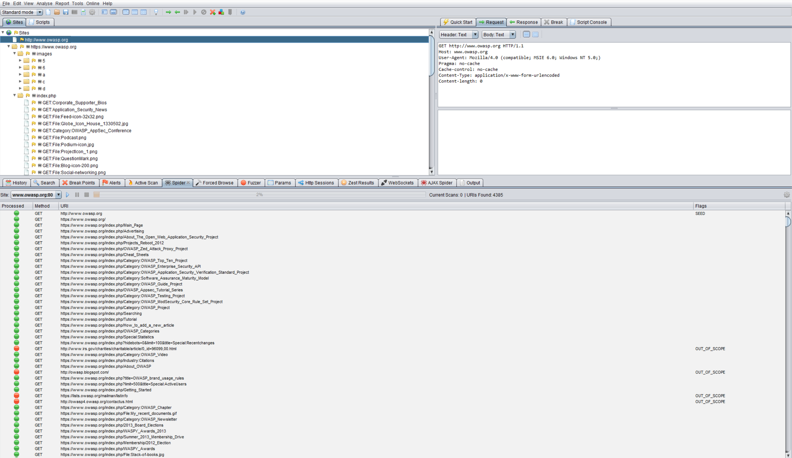

# Map Execution Paths Through Application

## Summary

Before commencing security testing, understanding the structure of the application is paramount. Without a thorough understanding of the layout of the application, it is unlkely that it will be tested thoroughly.

## Test Objectives

Map the target application and understand the principal workflows.

## How to Test

In black box testing it is extremely difficult to test the entire code base. Not just because the tester has no view of the code paths through the application, but even if they did, to test all code paths would be very time consuming. One way to reconcile this is to document what code paths were discovered and tested.

There are several ways to approach the testing and measurement of code coverage:

- **Path** - test each of the paths through an application that includes combinatorial and boundary value analysis testing for each decision path. While this approach offers thoroughness, the number of testable paths grows exponentially with each decision branch.
- **Data Flow (or Taint Analysis)** - tests the assignment of variables via external interaction (normally users). Focuses on mapping the flow, transformation and use of data throughout an application.
- **Race** - tests multiple concurrent instances of the application manipulating the same data.

The trade off as to what method is used and to what degree each method is used should be negotiated with the application owner. Simpler approaches could also be adopted, including asking the application owner what functions or code sections they are particularly concerned about and how those code segments can be reached.

### Black Box Testing

To demonstrate code coverage to the application owner, the tester can start with a spreadsheet and document all the links discovered by spidering the application (either manually or automatically). Then the tester can look more closely at decision points in the application and investigate how many significant code paths are discovered. These should then be documented in the spreadsheet with URLs, prose and screenshot descriptions of the paths discovered.

### Gray/White Box Testing

Ensuring sufficient code coverage for the application owner is far easier with the gray and white box approach to testing. Information solicited by and provided to the tester will ensure the minimum requirements for code coverage are met.

#### Example

### Automatic Spidering

The automatic spider is a tool used to automatically discover new resources (URLs) on a particular website. It begins with a list of URLs to visit, called the seeds, which depends on how the Spider is started. While there are a lot of Spidering tools, the following example uses the [Zed Attack Proxy (ZAP)](https://code.google.com/p/zaproxy/):

\
*Figure 4.2.7-1: Zed Attack Proxy Screen*

[ZAP](https://code.google.com/p/zaproxy/) offers the following automatic spidering features, which can be selected based on the tester's needs:

- Spider Site - The seed list contains all the existing URIs already found for the selected site.
- Spider Subtree - The seed list contains all the existing URIs already found and present in the subtree of the selected node.
- Spider URL - The seed list contains only the URI corresponding to the selected node (in the Site Tree).
- Spider all in Scope - The seed list contains all the URIs the user has selected as being 'In Scope'.

## Tools

- [Zed Attack Proxy (ZAP)](https://code.google.com/p/zaproxy/)
- [List of spreadsheet software](http://en.wikipedia.org/wiki/List_of_spreadsheet_software)
- [Diagramming software](http://en.wikipedia.org/wiki/Diagramming_software)

## References

### Whitepapers

- [Code Coverage](http://en.wikipedia.org/wiki/Code_coverage)
