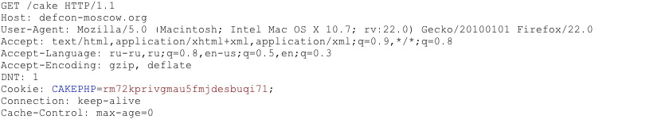
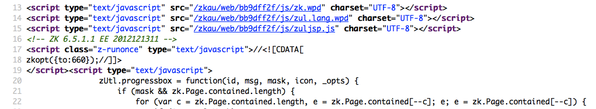
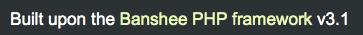

# Fingerprint Web Application Framework

## Summary

Web framework[*] fingerprinting is an important subtask of the information gathering process. Knowing the type of framework can automatically give a great advantage if such a framework has already been tested by the penetration tester. It is not only the known vulnerabilities in unpatched versions but specific misconfigurations in the framework and known file structure that makes the fingerprinting process so important.

Several different vendors and versions of web frameworks are widely used. Information about it significantly helps in the testing process, and can also help in changing the course of the test. Such information can be derived by careful analysis of certain common locations. Most of the web frameworks have several markers in those locations which help an attacker to spot them. This is basically what all automatic tools do, they look for a marker from a predefined location and then compare it to the database of known signatures. For better accuracy several markers are usually used.

[*] Please note that this article makes no differentiation between Web Application Frameworks (WAF) and Content Management Systems (CMS). This has been done to make it convenient to fingerprint both of them in one chapter. Furthermore, both categories are referenced as web frameworks.

## Test Objectives

To define type of used web framework so as to have a better understanding of the security testing methodology.

## How to Test

### Black Box Testing

There are several most common locations to look in in order to define the current framework:

- HTTP headers
- Cookies
- HTML source code
- Specific files and folders
- File Extensions
- Error Message

#### HTTP Headers

The most basic form of identifying a web framework is to look at the `X-Powered-By` field in the HTTP response header. Many tools can be used to fingerprint a target. The simplest one is netcat utility.

Consider the following HTTP Request-Response:

```html
$ nc 127.0.0.1 80
HEAD / HTTP/1.0

HTTP/1.1 200 OK
Server: nginx/1.0.14
Date: Sat, 07 Sep 2013 08:19:15 GMT
Content-Type: text/html;charset=ISO-8859-1
Connection: close
Vary: Accept-Encoding
X-Powered-By: Mono
```

From the `X-Powered-By` field, we understand that the web application framework is likely to be Mono. However, although this approach is simple and quick, this methodology doesn't work in 100% of cases. It is possible to easily disable `X-Powered-By` header by a proper configuration. There are also several techniques that allow a web site to obfuscate HTTP headers (see an example in [#Remediation](#Remediation) chapter).

So in the same example the tester could either miss the `X-Powered-By` header or obtain an answer like the following:

```html
HTTP/1.1 200 OK
Server: nginx/1.0.14
Date: Sat, 07 Sep 2013 08:19:15 GMT
Content-Type: text/html;charset=ISO-8859-1
Connection: close
Vary: Accept-Encoding
X-Powered-By: Blood, sweat and tears
```

Sometimes there are more HTTP-headers that point at a certain web framework. In the following example, according to the information from HTTP-request, one can see that `X-Powered-By` header contains PHP version. However, the `X-Generator` header points out the used framework is actually Swiftlet, which helps a penetration tester to expand his attack vectors. When performing fingerprinting, always carefully inspect every HTTP-header for such leaks.

```html
HTTP/1.1 200 OK
Server: nginx/1.4.1
Date: Sat, 07 Sep 2013 09:22:52 GMT
Content-Type: text/html
Connection: keep-alive
Vary: Accept-Encoding
X-Powered-By: PHP/5.4.16-1~dotdeb.1
Expires: Thu, 19 Nov 1981 08:52:00 GMT
Cache-Control: no-store, no-cache, must-revalidate, post-check=0, pre-check=0
Pragma: no-cache
X-Generator: Swiftlet
```

#### Cookies

Another similar and somehow more reliable way to determine the current web framework are framework-specific cookies.

Consider the following HTTP-request:

\
*Figure 4.2.8-1: Cakephp Http Request*

The cookie `CAKEPHP` has automatically been set, which gives information about the framework being used. List of common cookies names is presented in chapter [#Cookies](#Cookies). Limitations are the same - it is possible to change the name of the cookie. For example, for the selected `CakePHP` framework this could be done by the following configuration (excerpt from core.php):

```php
/**
* The name of CakePHP's session cookie.
*
* Note the guidelines for Session names states: "The session name references
* the session id in cookies and URLs. It should contain only alphanumeric
* characters."
* @link http://php.net/session_name
*/
Configure::write('Session.cookie', 'CAKEPHP');
```

However, these changes are less likely to be made than changes to the `X-Powered-By` header, so this approach can be considered as more reliable.

#### HTML Source Code

This technique is based on finding certain patterns in the HTML page source code. Often one can find a lot of information which helps a tester to recognize a specific web framework. One of the common markers are HTML comments that directly lead to framework disclosure. More often certain framework-specific paths can be found, i.e. links to framework-specific css and/or js folders. Finally, specific script variables might also point to a certain framework.

From the screenshot below one can easily learn the used framework and its version by the mentioned markers. The comment, specific paths and script variables can all help an attacker to quickly determine an instance of ZK framework.

\
*Figure 4.2.8-2: Cakephp Http Request*

More frequently such information is placed between `<head>``</head>`
tags, in `<meta>` tags or at the end of the page. Nevertheless, it is recommended to check the whole document since it can be useful for other purposes such as inspection of other useful comments and hidden fields. Sometimes, web developers do not care much about hiding information about the framework used. It is still possible to stumble upon something like this at the bottom of the page:

\
*Figure 4.2.8-3: Banshee Bottom Page*

#### File Extensions

URL may include file extensions. The file extensions can also help to identify the web platform or technology.

For example, OWASP is using PHP

```php
https://www.owasp.org/index.php?title=Fingerprint_Web_Application_Framework_OTG-INFO-008&action=edit&section=4
```

Here are some common web extensions and technology

- php -- PHP
- aspx -- Microsoft ASP.NET
- jsp -- Java Server Pages

#### Error Message

## Common Frameworks

### Cookies

|Framework  | Cookie name      |
|-----------|------------------|
| Zope      | zope3            |
| CakePHP   | cakephp          |
| Kohana    | kohanasession    |
| Laravel   | laravel_session |

### HTML Source Code

#### General Markers

- %framework_name%
- powered by
- built upon
- running

#### Specific Markers

| Framework          | Keyword              |
|--------------------|----------------------|
| Adobe ColdFusion   | &lt;!-- START headerTags.cfm |
| Microsoft ASP.NET  | __VIEWSTATE        |
| ZK   |  &lt;!-- ZK |
| Business Catalyst  | &lt;!-- BC_OBNW --&gt; |
| Indexhibit         |         ndxz-studio |

### Specific Files and Folders

Specific files and folders are different for each specific framework. It is recommended to install the corresponding framework during penetration tests in order to have better understanding of what infrastructure is presented and what files might be left on the server. However, several good file lists already exist and one good example is [FuzzDB wordlists of predictable files/folders](https://github.com/fuzzdb-project/fuzzdb).

## Tools

A list of general and well-known tools is presented below. There are also a lot of other utilities, as well as framework-based fingerprinting tools.

### WhatWeb

Website: [http://www.morningstarsecurity.com/research/whatweb](http://www.morningstarsecurity.com/research/whatweb)

Currently one of the best fingerprinting tools on the market. Included in a default [Kali Linux](https://www.kali.org/) build. Language: Ruby Matches for fingerprinting are made with:

- Text strings (case sensitive)
- Regular expressions
- Google Hack Database queries (limited set of keywords)
- MD5 hashes
- URL recognition
- HTML tag patterns
- Custom ruby code for passive and aggressive operations

Sample output is presented on a screenshot below:

\
*Figure 4.2.8-4: Whatweb Output sample*

### BlindElephant

Website:[http://blindelephant.sourceforge.net/](http://blindelephant.sourceforge.net/)

This great tool works on the principle of static file checksum based version difference thus providing a very high quality of fingerprinting. Language: Python

Sample output of a successful fingerprint:

```bash
pentester$ python BlindElephant.py http://my_target drupal
Loaded /Library/Python/2.7/site-packages/blindelephant/dbs/drupal.pkl with 145 versions, 478 differentiating paths, and 434 version groups.
Starting BlindElephant fingerprint for version of drupal at http://my_target

Hit http://my_target/CHANGELOG.txt
File produced no match. Error: Retrieved file doesn't match known fingerprint. 527b085a3717bd691d47713dff74acf4

Hit http://my_target/INSTALL.txt
File produced no match. Error: Retrieved file doesn't match known fingerprint. 14dfc133e4101be6f0ef5c64566da4a4

Hit http://my_target/misc/drupal.js
Possible versions based on result: 7.12, 7.13, 7.14

Hit http://my_target/MAINTAINERS.txt
File produced no match. Error: Retrieved file doesn't match known fingerprint. 36b740941a19912f3fdbfcca7caa08ca

Hit http://my_target/themes/garland/style.css
Possible versions based on result: 7.2, 7.3, 7.4, 7.5, 7.6, 7.7, 7.8, 7.9, 7.10, 7.11, 7.12, 7.13, 7.14

...

Fingerprinting resulted in:
7.14


Best Guess: 7.14
```

### Wappalyzer

Website: [http://wappalyzer.com](http://wappalyzer.com)

Wapplyzer is a Firefox Chrome plug-in. It works only on regular expression matching and doesn't need anything other than the page to be loaded on browser. It works completely at the browser level and gives results in the form of icons. Although sometimes it has false positives, this is very handy to have notion of what technologies were used to construct a target website immediately after browsing a page.

Sample output of a plug-in is presented on a screenshot below.

\
*Figure 4.2.8-5: Wappalyzer Output for OWASP Website*

## References

### Whitepapers

- [Saumil Shah: “An Introduction to HTTP fingerprinting”](http://www.net-square.com/httprint_paper.html)

- [Anant Shrivastava : “Web Application Finger Printing”](http://anantshri.info/articles/web_app_finger_printing.html)

## Remediation

The general advice is to use several of the tools described above and check logs to better understand what exactly helps an attacker to disclose the web framework. By performing multiple scans after changes have been made to hide framework tracks, it's possible to achieve a better level of security and to make sure of the framework can not be detected by automatic scans. Below are some specific recommendations by framework marker location and some additional interesting approaches.

### HTTP Headers

Check the configuration and disable or obfuscate all HTTP-headers that disclose information the technologies used. Here is an interesting article about HTTP-headers obfuscation using Netscaler

### Cookies

It is recommended to change cookie names by making changes in the corresponding configuration files.

### HTML Source Code

Manually check the contents of the HTML code and remove everything that explicitly points to the framework.

General guidelines:

- Make sure there are no visual markers disclosing the framework
- Remove any unnecessary comments (copyrights, bug information, specific framework comments)
- Remove META and generator tags
- Use the companies own css or js files and do not store those in a framework-specific folders
- Do not use default scripts on the page or obfuscate them if they must be used.

### Specific Files and Folders

General guidelines:

- Remove any unnecessary or unused files on the server. This implies text files disclosing information about versions and installation too.
- Restrict access to other files in order to achieve 404-response when accessing them from outside. This can be done, for example, by modifying htaccess file and adding RewriteCond or RewriteRule there. An example of such restriction for two common WordPress folders is presented below.

```apache
RewriteCond %{REQUEST_URI} /wp-login\.php$ [OR]
RewriteCond %{REQUEST_URI} /wp-admin/$
RewriteRule $ /http://your_website [R=404,L]
```

However, these are not the only ways to restrict access. In order to automate this process, certain framework-specific plugins exist. One example for WordPress is [StealthLogin](http://wordpress.org/plugins/stealth-login-page).

### Additional Approaches

General guidelines:

- Checksum management
  The purpose of this approach is to beat checksum-based scanners and not let them disclose files by their hashes. Generally, there are two approaches in checksum management:
  - Change the location of where those files are placed (i.e. move them to another folder, or rename the existing folder)
  - Modify the contents - even slight modification results in a completely different hash sum, so adding a single byte in the end of the file should not be a big problem.

- Controlled chaos
  A funny and effective method that involves adding bogus files and folders from other frameworks in order to fool scanners and confuse an attacker. But be careful not to overwrite existing files and folders and to break the current framework!
