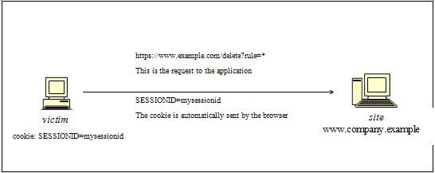
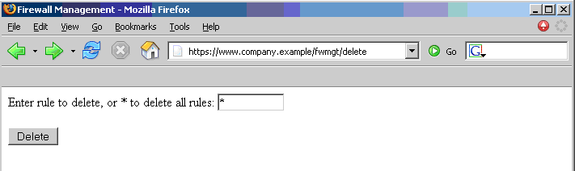
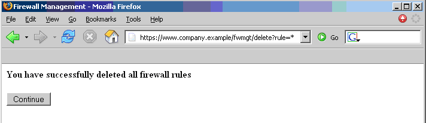

# Testing for CSRF

## Summary

Cross-site Request Forgery [CSRF](https://owasp.org/www-community/attacks/csrf) is an attack that forces an end user to execute unintended actions on a web application in which they are currently authenticated. With a little social engineering help (like sending a link via email or chat), an attacker may force the users of a web application to execute actions of the attacker's choosing. A successful CSRF exploit can compromise end user data and operation, when it targets a normal user. If the targeted end user is the administrator account, a CSRF attack can compromise the entire web application.

CSRF relies on the following:

1. Web browser behavior regarding the handling of session-related information such as cookies and HTTP authentication information.
2. Knowledge by the attacker of valid web application URLs, requests, or functionality.
3. Application session management relying only on information which is known by the browser.
4. Existence of HTML tags whose presence cause immediate access to an HTTP[S] resource; for example the image tag `img`.

Points 1, 2, and 3 are essential for the vulnerability to be present, while point 4 facilitates the actual exploitation, but is not strictly required.

Point 1) Browsers automatically send information which is used to identify a user session. Suppose *site* is a site hosting a web application, and the user *victim* has just authenticated to *site*. In response, *site* sends *victim* a cookie which identifies requests sent by *victim* as belonging to *victim’s* authenticated session. Basically, once the browser receives the cookie set by *site*, it will automatically send it along with any further requests directed to *site*.

Point 2) If the application does not make use of session-related information in URLs, then it means that the application URLs, their parameters, and legitimate values may be identified (either by code analysis or by accessing the application and taking note of forms and URLs embedded in the HTML/JavaScript).

Point 3) "Known by the browser” refers to information such as cookies, or HTTP-based authentication information (such as Basic Authentication; and not form-based authentication), which are stored by the browser and subsequently present at each request directed towards an application area requesting that authentication. The vulnerabilities discussed next apply to applications which rely entirely on this kind of information to identify a user session.

Suppose, for simplicity's sake, to refer to GET-accessible URLs (though the discussion applies as well to POST requests). If *victim* has already authenticated themselves, submitting another request causes the cookie to be automatically sent with it (see picture, where the user accesses an application on `www.example.com`).

\
*Figure 4.7.5-1:Session Riding*

The GET request could be originated in several different ways:

- by the user, who is using the actual web application;
- by the user, who types the URL directly in the browser;
- by the user, who follows a link (external to the application) pointing to the URL.

These invocations are indistinguishable by the application. In particular, the third may be quite dangerous. There are a number of techniques (and of vulnerabilities) which can disguise the real properties of a link. The link can be embedded in an email message, or appear in a malicious web site where the user is lured, i.e., the link appears in content hosted elsewhere (another web site, an HTML email message, etc.) and points to a resource of the application. If the user clicks on the link, since they were already authenticated by the web application on *site*, the browser will issue a GET request to the web application, accompanied by authentication information (the session id cookie). This results in a valid operation performed on the web application and probably not what the user expects to happen. Think of a malicious link causing a fund transfer on a web banking application to appreciate the implications.

By using a tag such as `img`, as specified in point 4 above, it is not even necessary that the user follows a particular link. Suppose the attacker sends the user an email inducing them to visit an URL referring to a page containing the following (oversimplified) HTML:

```html
<html><body>

...


...

</body></html>
```

What the browser will do when it displays this page is that it will try to display the specified zero-dimension (i.e. invisible) image as well. This results in a request being automatically sent to the web application hosted on *site*. It is not important that the image URL does not refer to a proper image, its presence will trigger the request specified in the `src` field anyway. This happens provided that image download is not disabled in the browsers, which is a typical configuration since disabling images would cripple most web applications beyond usability.

The problem here is a consequence of the following facts:

- there are HTML tags whose appearance in a page result in automatic HTTP request execution (`img` being one of those);
- the browser has no way to tell that the resource referenced by `img` is not actually an image and is in fact not legitimate;
- image loading happens regardless of the location of the alleged image, i.e., the form and the image itself need not be located in the same host, not even in the same domain. While this is a very handy feature, it makes difficult to compartmentalize applications.

It is the fact that HTML content unrelated to the web application may refer components in the application, and the fact that the browser automatically composes a valid request towards the application, that allows such kind of attacks. As no standards are defined right now, there is no way to prohibit this behavior unless it is made impossible for the attacker to specify valid application URLs. This means that valid URLs must contain information related to the user session, which is supposedly not known to the attacker and therefore make the identification of such URLs impossible.

The problem might be even worse, since in integrated mail/browser environments simply displaying an email message containing the image would result in the execution of the request to the web application with the associated browser cookie.

Things may be obfuscated further, by referencing seemingly valid image URLs such as:

```html

```

where [attacker] is a site controlled by the attacker, and by utilizing a redirect mechanism on

`http://[attacker]/picture.gif` to `http://[thirdparty]/action`.

Cookies are not the only example involved in this kind of vulnerability. Web applications whose session information is entirely supplied by the browser are vulnerable too. This includes applications relying on HTTP authentication mechanisms alone, since the authentication information is known by the browser and is sent automatically upon each request. This DOES NOT include form-based authentication, which occurs just once and generates some form of session-related information (of course, in this case, such information is expressed simply as a cookie and we can fall back to one of the previous cases).

**Sample scenario.**

Let’s suppose that the victim is logged on to a firewall web management console. To login, a user has to authenticate themselves and session information is stored in a cookie.

Let's suppose the firewall web management console has a function that allows an authenticated user to delete a rule specified by its positional number, or all the rules of the configuration if the user enters `*` (quite a dangerous feature, but it will make the example more interesting). The delete page is shown next. Let’s suppose that the form – for the sake of simplicity – issues a GET request, which will be of the form:

`https://[target]/fwmgt/delete?rule=1`

(to delete rule number one)

`https://[target]/fwmgt/delete?rule=*`

(to delete all rules).

The example is purposely quite naive, but shows in a simple way the dangers of CSRF.

\
*Figure 4.7.5-2:Session Riding Firewall Management*

Therefore, if we enter the value `*` and press the Delete button, the following GET request is submitted.

`https://www.company.example/fwmgt/delete?rule=*`

with the effect of deleting all firewall rules (and ending up in a possibly inconvenient situation).

\
*Figure 4.7.5-3:Session Riding Firewall Management 2*

Now, this is not the only possible scenario. The user might have accomplished the same results by manually submitting the URL

`https://[target]/fwmgt/delete?rule=*`

or by following a link pointing, directly or via a redirection, to the above URL. Or, again, by accessing an HTML page with an embedded `img` tag pointing to the same URL.

In all of these cases, if the user is currently logged in to the firewall management application, the request will succeed and will modify the configuration of the firewall. One can imagine attacks targeting sensitive applications and making automatic auction bids, money transfers, orders, changing the configuration of critical software components, etc.

An interesting thing is that these vulnerabilities may be exercised behind a firewall; i.e. it is sufficient that the link being attacked be reachable by the victim (not directly by the attacker). In particular, it can be any Intranet web server; for example, the firewall management scenario mentioned before, which is unlikely to be exposed to the Internet. Imagine a CSRF attack targeting an application monitoring a nuclear power plant. Sounds far fetched? Probably, but it is a possibility.

Self-vulnerable applications, i.e. applications that are used both as attack vector and target (such as web mail applications), make things worse. If such an application is vulnerable, the user is obviously logged in when they read a message containing a CSRF attack, that can target the web mail application and have it perform actions such as deleting messages, sending messages appearing as sent by the user, etc.

## Test Objectives

Determine whether it is possible to initiate requests on the users' behalf, yet not specifically initiated by the user(s).

## How to Test

### Black-Box Testing

For a black-box test the tester must know URLs in the restricted (authenticated) area. If they possess valid credentials, they can assume both roles – the attacker and the victim. In this case, testers know the URLs to be tested just by browsing around the application.

Otherwise, if testers don’t have valid credentials available, they have to organize a real attack, and so induce a legitimate, logged in user into following an appropriate link. This may involve a substantial level of social engineering.

Either way, a test case can be constructed as follows:

- let *u* be the URL being tested; for example, u = `http://www.example.com/action`;
- build an HTML page containing the HTTP request referencing URL *u* (specifying all relevant parameters; in the case of HTTP GET this is straightforward, while to a POST request you need to resort to some Javascript);
- make sure that the valid user is logged on the application;
- induce them into following the link pointing to the URL to be tested (social engineering involved if you cannot impersonate the user yourself);
- observe the result, i.e. check if the web server executed the request.

### Gray-Box Testing

Audit the application to ascertain if its session management is vulnerable. If session management relies only on client side values (information available to the browser), then the application is vulnerable. "Client side values” mean cookies and HTTP authentication credentials (Basic Authentication and other forms of HTTP authentication; not form-based authentication, which is an application-level authentication).

Resources accessible via HTTP GET requests are easily vulnerable, though POST requests can be automated via Javascript and are vulnerable as well; therefore, the use of POST alone is not enough to correct the occurrence of CSRF vulnerabilities.

In case of POST, the following sample can be used.

- Step 1. Create HTML similar to that shown below
- Step 2. Host the HTML on a malicious or public site
- Step 3. Send the link `http://maliciousSite/CSRF.html` to the victim(s) who click it.

```html
<html>
<body onload='document.CSRF.submit()'>

<form action='http://tagetWebsite/Authenticate.jsp' method='POST' name='CSRF'>
    <input type='hidden' name='name' value='Hacked'>
    <input type='hidden' name='password' value='Hacked'>
</form>

</body>
</html>
```

In case of web applications in which developers are utilizing JSON for browser to server communication. A problem may arise with the fact that there are no query parameters with the JSON format, which are a must with self-submitting forms. To bypass this case, we can use a self-submitting form with JSON payloads including hidden input to exploit CSRF. We'll have to change the encoding type (enctype) to `text/plain` for sanity (to ensure the payload is delivered "as is"). The exploit code will look like the following:

```html
<html>
 <body>
  <script>history.pushState('', '', '/')</script>
   <form action='http://victimsite.com' method='POST' enctype='text/plain'>
     <input type='hidden' name='{"name":"hacked","password":"hacked","padding":"'value='something"}' />
     <input type='submit' value='Submit request' />
   </form>
 </body>
</html>
```

The POST request will be as follow:

```html
POST / HTTP/1.1
Host: victimsite.com
Content-Type: text/plain

{"name":"hacked","password":"hacked","padding":"=something"}
```

when this data is sent as a POST request, the server will happily accept the name and password fields and ignore the one with the name padding as it does not need it.

## Remediation

- The [OWASP Development Guide](https://www.owasp.org/index.php/Category:OWASP_Guide_Project) provides guidance on how to [Avoid CSRF](https://github.com/OWASP/DevGuide/blob/master/03-Build/0x04-SessionManagement.md) Vulnerabilities.
- See the [OWASP CSRF Prevention Cheat Sheet](https://cheatsheetseries.owasp.org/cheatsheets/Cross-Site_Request_Forgery_Prevention_Cheat_Sheet.html) for prevention measures.

## Tools

- [OWASP ZAP](https://www.zaproxy.org/)
- [CSRF Tester](https://wiki.owasp.org/index.php/Category:OWASP_CSRFTester_Project)
- [Pinata-csrf-tool](https://code.google.com/p/pinata-csrf-tool/)

## References

### Whitepapers

- [Peter W: “Cross-Site Request Forgeries”](https://web.archive.org/web/20160303230910/http://www.tux.org/~peterw/csrf.txt)
- [Thomas Schreiber: “Session Riding”](https://web.archive.org/web/20160304001446/http://www.securenet.de/papers/Session_Riding.pdf)
- [Oldest known post](https://web.archive.org/web/20000622042229/http://www.zope.org/Members/jim/ZopeSecurity/ClientSideTrojan)
- [Cross-site Request Forgery FAQ](http://www.cgisecurity.com/articles/csrf-faq.shtml)
- [A Most-Neglected Fact About Cross Site Request Forgery (CSRF)](http://yehg.net/lab/pr0js/view.php/A_Most-Neglected_Fact_About_CSRF.pdf)
- [Multi-POST CSRF](https://www.lanmaster53.com/2013/07/17/multi-post-csrf/)
- [SANS Pen Test Webcast: Complete Application pwnage via Multi POST XSRF](https://www.youtube.com/watch?v=EOs5PZiiwug)
