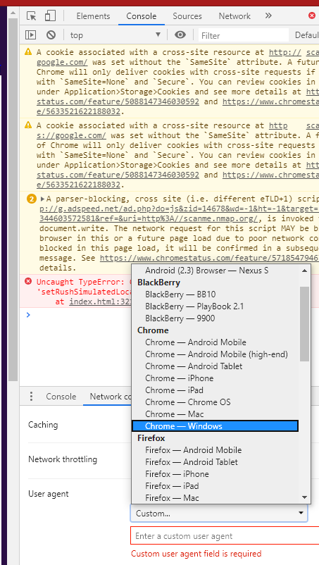
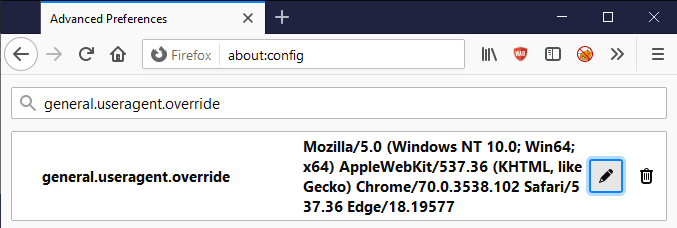
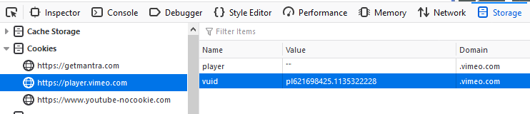
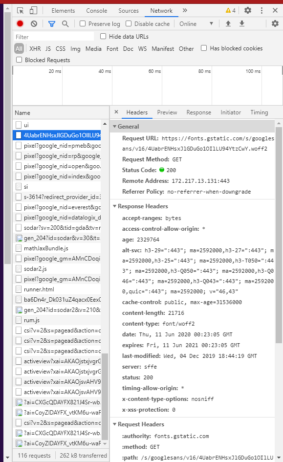
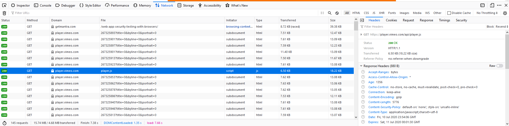
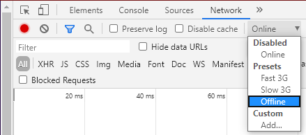
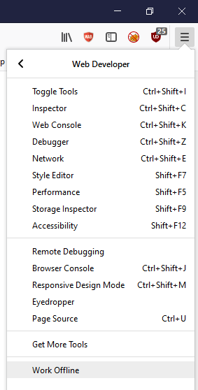
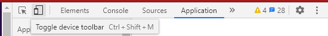
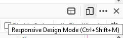

# Leveraging Dev Tools

This appendix outlines various details for use of in browser Developer Tool functionality to aid in security testing activities.

Obviously in browser functionality is not a substitute for: DAST (Dynamic Application Security Testing) tools, SAST (Static Application Security Testing) tools, or a tester's experience, however, it can be leveraged for some testing activities and report production related tasks.

## Accessing Dev Tools

Opening Dev Tools can be accomplished in a number of ways.

1. Via the keyboard shortcut `F12`.
2. Via the keyboard shortcut `ctrl` + `shift` + `i` on Windows.
3. Via the keyboard short cut `cmd` + `option` + `i` on Mac.
4. Via the web page right-click context menu and then selecting `Inspect` in Google Chrome.
5. Via the web page right-click context menu and then selecting `Inspect Element` in Mozilla Firefox.
6. Via the triple dot 'kabob' menu in Google Chrome then selecting `More Tools` and then `Developer Tools`.
7. Via the triple line 'hamburger' (or 'pancake') menu in Mozilla Firefox then selecting `Web Developer` and then `Toggle Tools`.
8. Via the gear icon settings menu in Edge/IE then selecting `Developer Tools`.

> NOTE: The majority of the instructions below assume that Dev Tools is already open or active.

## Capabilities

| Functionality         | Chrome* | Firefox | Edge/IE | Safari |
|-----------------------|:-------:|:-------:|:-------:|:------:|
| User-Agent Switching  | Y       | Y       | Y       | Y      |
| Edit/Resend Requests  | Y       | Y       | N       | N      |
| Cookie Editing        | Y       | Y       | Y       | N      |
| Local Storage Editing | Y       | Y       | Y       | N      |
| Disable CSS           | Y       | Y       | Y       | Y      |
| Disable JavaScript    | Y       | Y       | N       | Y      |
| View HTTP Headers     | Y       | Y       | Y       | Y      |
| Screenshots           | Y       | Y       | Y       | N      |
| Offline Mode          | Y       | Y       | N       | N      |
| Encoding and Decoding | Y       | Y       | Y       | Y      |
| Responsive Design Mode| Y       | Y       | Y       | Y      |

`*` Anything that applies to Google Chrome should be applicable to all Chromium based applications. (Which includes Microsoft rebadging Edge around 2019/2020.)

## User-Agent Switching

### Related Testing

- [Testing for Browser Cache Weaknesses](../4-Web_Application_Security_Testing/04-Authentication_Testing/06-Testing_for_Browser_Cache_Weaknesses.md)

### Google Chrome

1. Click on triple dot 'kabob' menu on the right side of the Developer Tools pane, select `More tools` then select `Network conditions`.
2. Un-check the "Select automatically" checkbox.
3. Select the user agent from dropdown menu or enter a custom user agent

\
*Figure 6.F-1: Google Chrome Dev Tools User-Agent Switching Functionality*

### Mozilla Firefox

1. Navigate to Firefox’s `about:config` page and click `I accept the risk!`.
2. Enter `general.useragent.override` into the search field.
3. Look for `general.useragent.override`, if you can't see this preference, look for one that show a set of radio buttons `Boolean, Number, String` select `String` then click the plus sign `Add` button on the `about:config` page.
4. Set the value of `general.useragent.override` to whatever [User-Agent](https://developers.whatismybrowser.com/useragents/explore/) you might need.

\
*Figure 6.F-2: Mozilla Firefox User-Agent Switching Functionality*

Later click on the garbage can `Delete` button to the right of the `general.useragent.override` preference to remove the override and switch back to the default user agent.

## Edit/Resend Requests

### Related Testing

- [Authentication Testing](../4-Web_Application_Security_Testing/04-Authentication_Testing/README.md)
- [Authorization Testing](../4-Web_Application_Security_Testing/05-Authorization_Testing/README.md)
- [Session Management Testing](../4-Web_Application_Security_Testing/06-Session_Management_Testing/README.md)
- [Input Validation Testing](../4-Web_Application_Security_Testing/07-Input_Validation_Testing/README.md)
- [Business Logic Testing](../4-Web_Application_Security_Testing/10-Business_Logic_Testing/README.md)

### Mozilla Firefox

1. Select the `Network` tab.
2. Perform any action in the web application.
3. Right-click on the HTTP request from the list and select `Edit and Resend`.
4. Make desired modifications and click on the `Send` button.
5. Right-click on the modified request and select `Open in New Tab`.

### Google Chrome

1. Select the `Network` tab.
2. Perform any action in the web application.
3. Right-click on the HTTP request from the list and select `Copy > Copy as fetch`.
4. Paste the provided JavaScript code into the `Console` tab.
5. Make any required modifications, and then hit enter to send the request.

## Cookie Editing

### Related Testing

- [Authentication Testing](../4-Web_Application_Security_Testing/04-Authentication_Testing/README.md)
- [Authorization Testing](../4-Web_Application_Security_Testing/05-Authorization_Testing/README.md)
- [Session Management Testing](../4-Web_Application_Security_Testing/06-Session_Management_Testing/README.md)
- [Testing for Cookie Attributes](../4-Web_Application_Security_Testing/06-Session_Management_Testing/02-Testing_for_Cookies_Attributes.md)

### Google Chrome

1. Click the `Application` tab.
2. Expand `Cookies` under the `Storage` heading.
3. Select the relevant domain name.
4. Double click in the `Value` column to edit any cookie value.

> Note: Cookies can be deleted once selected by pressing the `delete` key, or from the right-click context menu.

### Mozilla Firefox

1. Click the `Storage` tab.
2. Expand the `Cookies` section.
3. Select the relevant domain name.
4. Double click in the `Value` column to edit any cookie value.

> Note: Cookies can be deleted once selected by pressing the `delete` key, or with various options from the right-click context menu.

\
*Figure 6.F-3: Mozilla Firefox Cookie Editing Functionality*

## Local Storage Editing

### Related Testing

- [Testing Browser Storage](../4-Web_Application_Security_Testing/11-Client-side_Testing/12-Testing_Browser_Storage.md)

### Google Chrome

1. Click the `Application` tab.
2. Expand `Local Storage` under the `Storage` heading.
3. Select the relevant domain name.
4. Double click in the `Value` column to edit any cookie value.
5. Double click in the applicable Cell to edit the `Key` or `Value`.

> Note: Editing `Session Storage` or `Index DB` follows essentially the same steps.
>
> Note: Items can be added or deleted via the right-click context menu.

### Mozilla Firefox

1. Click the `Storage` tab.
2. Expand the `Local Storage` section.
3. Select the relevant domain name.
4. Double click in the applicable Cell to edit the `Key` or `Value`.

> Note: Editing `Session Storage` or `Index DB` follows essentially the same steps.
>
> Note: Items can be added or deleted via the right-click context menu.

## Disable CSS

### Related Testing

- [Testing for Client-side Resource Manipulation](../4-Web_Application_Security_Testing/11-Client-side_Testing/06-Testing_for_Client-side_Resource_Manipulation.md)

### General

All major browsers support manipulating CSS leveraging the Dev Tools Console and JavaScript functionality:

- To remove all external style-sheets: `$('style,link[rel="stylesheet"]').remove();`
- To remove all internal style-sheets: `$('style').remove();`
- To remove all in-line styles: `Array.prototype.forEach.call(document.querySelectorAll('*'),function(el){el.removeAttribute('style');});`
- To remove everything from head tag: `$('head').remove();`

## Disable JavaScript

### Google Chrome

1. Click on triple dot 'kabob' menu on the right side of the web developer toolbar and click on `Settings`.
2. On the `Preferences` tab, under the `Debugger` section, check the `Disable JavaScript` checkbox.

### Mozilla Firefox

1. On the dev tools `Debugger` tab, click on the settings gear button in the upper right corner of the developer toolbar.
2. Select `Disable JavaScript` from the dropdown (this is an enable/disable menu item; when JavaScript is disabled, the menu item has a check mark).

## View HTTP Headers

### Related Testing

- [Information Gathering](../4-Web_Application_Security_Testing/01-Information_Gathering/README.md)

### Google Chrome

1. On the `Networking` tab in Dev Tools select any URL or request.
2. In the lower right hand pane select the `Headers` tab.

\
*Figure 6.F-4: Google Chrome Headers View*

### Mozilla Firefox

1. On the `Networking` tab in Dev Tools select any URL or request.
2. In the lower right hand pane select the `Headers` tab.

\
*Figure 6.F-5: Mozilla Firefox Headers View*

## Screenshots

### Related Testing

- [Reporting](../5-Reporting/README.md)

### Google Chrome

1. Press on the `Toggle Device Toolbar` button or press `ctrl` + `shift` + `m`.
2. Click the triple dot 'kabob' menu in the Device Toolbar.
3. Select `Capture screenshot` or `Capture full size screenshot`.

### Mozilla Firefox

1. Press the triple dot `ellipsis` button in the address bar.
2. Select `Take a Screenshot`.
3. Select either the `Save full page` or `Save visible` option.

## Offline Mode

### Google Chrome

1. Navigate to `Network` tab.
2. In the `Throttle` dropdown select `Offline`.

\
*Figure 6.F-6: Google Chrome Offline Option*

### Mozilla Firefox

1. From the triple line 'hamburger' (or 'pancake') menu select `Web Developer` and then `Work Offline`.

\
*Figure 6.F-7: Mozilla Firefox Offline Option*

## Encoding and Decoding

### Related Testing

- Many (perhaps even most) types of [Web Application Security Testing](../4-Web_Application_Security_Testing/README.md) can benefit from various types of encoding.

### General

All major browsers support encoding and decoding strings in various ways leveraging the Dev Tools Console and JavaScript functionality:

- base64 encode: `btoa("string-to-encode")` & base64 decode: `atob("string-to-decode")` - built-in JavaScript functions that are used to encode a string to base64 and decode a string from base64.
- URL encode: `encodeURIComponent("string-to-encode")` & URL decode: `decodeURIComponent("string-to-decode")` - It encodes and decodes user-supplied input that will be used as a part of a URL, and it encodes all characters that have special meanings in a URL, including reserved characters.
- URL encode: `encodeURI()` and URL decode: `decodeURI()` are functions used to encode and decode a complete URI, such as query parameters, path segments, or fragments, including special characters but excluding the reserved characters such as `:/?#[]@!$'()*+,;=` which have special meanings in a URL.

## Responsive Design Mode

### Related Testing

- [Testing for Browser Cache Weaknesses](../4-Web_Application_Security_Testing/04-Authentication_Testing/06-Testing_for_Browser_Cache_Weaknesses.md)
- [Testing for Weaker Authentication in Alternative Channel](../4-Web_Application_Security_Testing/04-Authentication_Testing/10-Testing_for_Weaker_Authentication_in_Alternative_Channel.md)
- [Testing for Clickjacking](../4-Web_Application_Security_Testing/11-Client-side_Testing/09-Testing_for_Clickjacking.md)

### Google Chrome

1. Click the `Toggle device toolbar` button or press `ctrl` + `shift` + `m`.

\
*Figure 6.F-8: Google Chrome Responsive Design Mode*

### Mozilla Firefox

1. Click the `Responsive Design Mode` button or press `ctrl` + `shift` + `m`.

\
*Figure 6.F-9: Mozilla Firefox Responsive Design Mode*

## References

- [Web App Security Testing with Browsers](https://getmantra.com/web-app-security-testing-with-browsers/)
- [Black Hills Information Security - Webcast: Free Tools! How to Use Developer Tools and JavaScript in Webapp Pentests](https://www.blackhillsinfosec.com/webcast-free-tools-how-to-use-developer-tools-and-javascript-in-webapp-pentests/)
- [Greg Malcolm - Chrome Developer Tools: Raiding the Armory](https://github.com/gregmalcolm/wacky-wandas-wicked-weapons-frontend/blob/fix-it/README.md)
- [List of UserAgent Strings](http://user-agent-string.info/list-of-ua)
